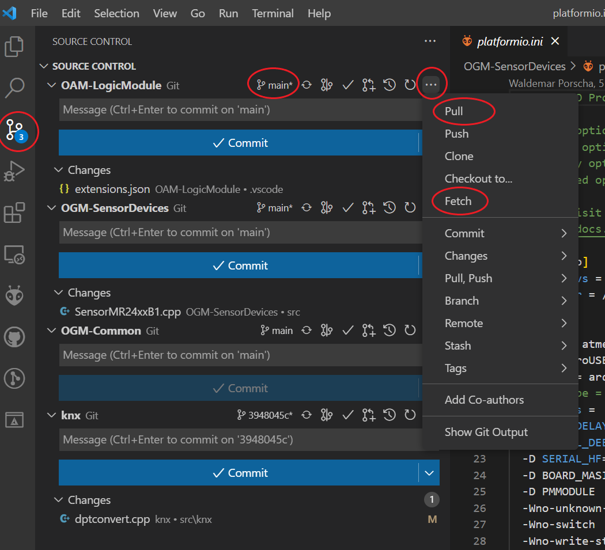
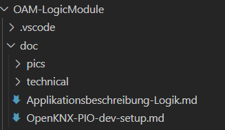
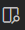

<!-- 
cSpell:words Clonen
-->
# Editieren der Applikationsbeschreibung 

Die nachfolgende Anleitung beschreibt die Schritte für das Bearbeiten der Applikationsbeschreibung eines Moduls. Dabei wird die Installation von Visual Studio Code (VSCode) und das Clonen eines Projektes für die Arbeitsschritte vorausgesetzt.

## Änderungshistorie

Im folgenden werden Änderungen an dem Dokument erfasst, damit man nicht immer das Gesamtdokument lesen muss, um Neuerungen zu erfahren.

02.09.2022: Initiale Version

## **Einleitung**

In den jeweiligen Projekten dient die Applikationsbeschreibung dazu, die Funktionalitäten und Applikationsmöglichkeiten des Moduls zu beschreiben. Die Beschreibung ist als Textfile im Markdown Format im Unterverzeichnis /doc des Projektes abgelegt und kann in github direkt mit einem Browser und vielen anderen Programmen formatiert angezeigt werden. 

## **Vorbereitungen**

* Das jeweilige Projekt (workspace) im VSCode öffnen
* Aus der Menüleiste auf der linken Seite Git Source Control auswählen
* Durch Auswahl der drei Punkte rechts oben den Befehl "git fetch" für das Projekt ausführen
* Sicherstellen, dass man im branch "main" ist
* wenn nicht, dann durch einen Klick auf das Feld zum branch "main" wechseln
* Abschließend noch ein "Git Pull" (wieder über das Untermenü der drei Punkte) ausführen
* Danach einen neuen working branch erzeugen und in diesen branch wechseln

<kbd></kbd>

* Im VSCode-Explorer den Pfad für die Applikationsbeschreibung finden. Der Pfad ist jeweils in dem Projekt im Unterverzeichnis ../doc und enthält in einem weiteren Unterverzeichnis (../pics) die zugehörigen Bilder. In den Unterverzeichnis ../technical können weitere technische Informationen z.B. für Diagnoseausgaben abgelegt werden.

In diesem Beispiel für das OAM-LogicModule/doc
auf Applikationsbeschreibung-Logik.md klicken

<kbd></kbd>

## **Text bearbeiten**

Im Editor sieht man jetzt den Quelltext für die Dokumentation, das Format ist "Markdown".
Durch einen Klick auf das Symbol Preview im Editor <kbd></kbd> (oben rechts), wird in einem weiteren Fenster eine ungefähre Vorschau auf die Ausgabe in github angezeigt.

Um an einer Dokumentation erst einmal unabhängig zu arbeiten, ohne ggf. aus Versehen die bisherige Version zu verändern, ist es sinnvoll temporär einen neuen Branch (z.B."Vorname-doc") anzulegen und dort zu editieren. Nach einem Review wird dieser Branch mit der bestehenden Version zusammengeführt.

## **Screenshots erzeugen**

Screenshots unter Win10 erstellt man am einfachsten mit der Tastenkombination "Shift+Win+S", dabei kann man den Bereich auswählen. Danach erscheint ein Editor, von dem aus das Bild gesichert werden kann. Dabei immer als png-Format sichern und auf Groß-Kleinschreibung achten.

## **Bilder einbinden**
Gespeichert werden alle Bilder im Unterverzeichnis pics im doc-Ordner.
Das Konstrukt `<kbd></kbd>` bindet das Bild dann ein. Das `<kbd>...</kbd>` erzeugt dabei einen Rahmen um das Bild, um die Lesbarkeit zu verbessern. In der Vorschau wird dieser Rahmen noch nicht angezeigt. Das Wort in eckigen Klammern ist frei wählbar und sollte eine Bildunterschrift sein. Es erscheint bei manchen Browsern als Tooltip, wenn man mit der Maus über dem Bild ist. Gedacht ist es für Blindenunterstützung, der Text erscheint auch auf der Braille-Zeile. In den runden Klammern ist dann der **relative** Pfad zum Bild, in diesem Fall immer pics/, gefolgt vom Dateinamen (case sensitive) mit der Endung .png. 

