<!-- 
cSpell:words knxprod EEPROM Ausgangstrigger Sonnenstandsbezogene Sonnenauf vollzumüllen Enocean Pieptönen platformio
cSpell:words softwareseitig untergangszeit Urlaubsinfo Feiertagsinfo Konverterfunktionen Vergleicher Geokoordinaten
cSpell:words Konstantenbelegung vorzubelegen Intervallvergleich Hysteresevergleich Uebersicht Logiktrigger priorität
cSpell:words Szenenkonverter Szenennummern Zahlenbasierte Intervallgrenzen Hystereseschalter Ganzzahlbasierte
cSpell:words erwartungskonform hardwareabhängig Rueckkopplung eingabebereit maliges AUSschaltverzögerung EINschaltverzögerung
cSpell:words Triggersignal expample runterladen Wiregateway updatefähige Updatefunktion Auskühlalarm Zaehler tagestrigger
cSpell:words mgeramb ambiente Ambientenbeleuchtung
-->

# Applikationsbeschreibung Logik

Die Applikation Logik erlaubt eine Parametrisierung von Logikkanälen mit der ETS.

Sie ist in die Bereiche

* Allgemeine Parameter
* Logikkanäle

gegliedert, wobei die Logikkanäle wiederum in bis zu 99 Kanäle untergliedert sind. Die real verfügbare Anzahl von Logikkanälen hängt von der konkreten ETS-Applikation ab, die die Logikapplikation nutzt.

## Änderungshistorie

Im folgenden werden Änderungen an dem Dokument erfasst, damit man nicht immer das Gesamtdokument lesen muss, um Neuerungen zu erfahren.

<!-- xx.xx.2022: Firmware 1.0.0, Applikation 1.0

* (intern) Kein EEPROM mehr nötig, KO-Werte werden im Flash gespeichert -->

08.10.2022: Firmware 0.12.1, Applikation 0.12 (Beta-Release)

* Formales Update, damit die Links auf die Dokumentation stimmen. Hier gab es einen Fehler im Release-Prozess.
* Es gibt keinen funktionalen Unterschied zwischen 0.12.0 und 0.12.1 und die Applikationen sind identisch. Wer 0.12.0 verwendet, muss kein Upgrade machen. Wer 0.11 verwendet, sollte ein Update auf 0.12.1 machen.

02.10.2022: Firmware 0.12.0, Applikation 0.12 (Beta-Release)

* NEU: Interne Ausgänge (als Quelle für die X- und Y-Eingänge eines Logikkanals) können jetzt neben EIN- und AUS-Werten auch nur EIN- oder nur AUS-Werte weiterleiten. Siehe [Interne Eingänge](#interne-eingänge).
* NEU: Zu den mathematischen Funktionen, die Ausgangswerte berechnen können, ist jetzt die Funktion **% (Modulo)**, also Rest-Division, hinzugekommen.
* NEU: Neben den mathematischen Funktionen, die Ausgangswerte berechnen können, sind jetzt auch Bitoperationen hinzugekommen. Siehe [Standardformeln](#standardformeln). Es gibt jetzt
    * **& (Bit-Und)**, 
    * **| (Bit-Oder)**,
    * **^ (Bit-Exklusiv-Oder)**, 
    * **<< (Bit-Links-Verschiebung)**,
    * **>> (Bit-Rechts-Verschiebung)**
* FIX: Bei der Einstellung ["Nur bei geändertem Ergebnis, aber erstes Telegramm immer senden"](#nur-bei-geändertem-ergebnis-aber-erstes-telegramm-nicht-senden) wurde das zweite Telegramm auch gesendet, wenn es gleich zum unterdrückten war. Das ist jetzt korrigiert.
* Die Zeitbasis für Zeitschaltuhren ist jetzt genauer, die Zeitschaltuhren driften jetzt weniger.

26.09.2022: Firmware 0.11.0, Applikation 0.11 (Beta-Release)

* NEU: Logikfunktion "Schalter" hinzugefügt. Siehe neues Kapitel ["Schalter (RS-Flip-Flop)"](#schalter-rs-flipflop)
* Neues Beispiel ["Einfacher Szenen-Controller"](#einfacher-szenen-controller) zugefügt.
* NEU: Feiertag Nationalfeiertag (AT) zugefügt (danke an mgeramb für den Code) 
* NEU: Feiertag Maria Empfängnis (AT) zugefügt (danke an mgeramb für den Code) 
* FIX: Typo "Fronleichnam" korrigiert
* FIX: Eingangskonverter für Einzelwerte funktioniert jetzt korrekt
* FIX: Wenn man einen (oder mehrere) Logikkanäle ausgelassen hat, konnte es passieren, dass die Logiken hinter der Lücke nicht mehr ausgeführt wurden (z.B. Kanal 1, 2, 3, 5 => 5 wird nicht mehr berechnet)

31.08.2022: Firmware 0.8.0, Applikation 0.8 (Beta-Release)

* Es gibt keine Änderungen an der Firmware oder ETS-Applikation, kein Update der Hardware oder der ETS nötig.
* Die Applikationsbeschreibung wurde um ein Beispiel ["Zeitschaltuhr schaltet alle 3 Tage"](#zeitschaltuhr-soll-jeden-n-ten-tag-schalten) ergänzt.
* Die Änderungshistorie wird jetzt in der umgekehrten Reihenfolge aufgeführt (vom neusten Eintrag als erstes bis hin zum ältesten als letztes). So werden die neusten Änderungen gleich zu Anfang präsentiert.
* Alle Bilder, Grafiken und Bildschirmfotos in der Anleitung haben jetzt einen Rahmen, der diese vom Text etwas absetzt. Dies erhöht die Lesbarkeit. 

01.05.2022: Firmware 0.8.0, Applikation 0.8 (Beta-Release)

* Frauentag wurde in die Liste der Feiertage aufgenommen.

23.04.2022: Firmware 0.7.0, Applikation 0.7 (Beta-Release)

* initiales Release als OpenKNX LogicModule
* Basiert auf dem [Vorgänger-Logikmodul](https://github.com/mumpf/knx-logik) version 3.8 (im folgenden stehen die Neuerungen gegenüber 3.8)
* Erzeugung von Firmware und knxprod wurde stark vereinfacht
* (intern) verbesserte Kommunikation mit dem KNX-Bus
* ETS-Applikation wird auch mit der ETS 6 getestet
* Eingänge können jetzt auch beliebige Kommunikationsobjekte der gesamten Applikation (nicht nur des Logikmoduls) sein, keine Verbindung über GA nötig
* Die ETS-Applikation wurde optisch überarbeitet und übersichtlicher gestaltet
* ETS-Kanäle werden neu unterstützt
* Es wird technisch überprüft, ob die ETS-Applikation mit der installierten Firmware übereinstimmt
* **Wichtig:** Diese Version ist eine komplett neue Applikation und somit nicht kompatibel zu der früheren Version 3.8. Die ETS-Applikation muss komplett neu parametrisiert werden.
* BUGFIX: Logikausgang war per Default "false" statt "initial". Damit wurde bei der Einstellung "nur bei Änderungen senden" so lange nichts gesendet, bis das erste Mal ein "true" festgestellt wird.
* FEATURE: Ein Tor kann jetzt auch einen Impulseingang haben. Damit wird das Tor geöffnet und danach sofort wieder geschlossen. So kann man auf eine einfache Weise Wertänderungen getaktet weiterleiten.

## **Einleitung**

Es gibt bis zu 99 Logikkanäle (abhängig von der Applikation, in die das Logikmodul integriert ist) mit folgenden Features:

Logikfunktionen mit bis zu 2 externen und 2 internen Eingängen

* UND
* ODER
* EXOR
* TOR/Sperre
* Zeitschaltuhr
* Schalter

Einstellbare Ausgangstrigger

* Bei Wertänderung am Ausgang
* Bei jedem Eingangstelegramm
* Nur beim Eingangstelegramm am Eingang 1 oder am Eingang 2

Mehrere Kanäle können zu größeren Logikblöcken zusammengefasst werden

Eingänge unterstützen DPT 1, 2, 5, 5.001, 6, 7, 8, 9, 17

Ausgänge unterstützen zusätzlich den DPT 16

Generische Konvertierung zwischen Ein- und Ausgangs-DPT

Alle Ein- und Ausgänge können ihre Werte invertieren

Eingänge können aktiv Werte lesen

* beim Startup
* Zyklisch mit einstellbarer Zeit
* Zyklisch bis die erste Antwort kommt

Wiederholfilter: Wenn mehrfach EIN- oder AUS-Telegramme hintereinander kommen, kann man

* Alle Wiederholungen durchlassen
* Nur EIN-Wiederholungen durchlassen, AUS nur einmal
* Nur AUS-Wiederholungen durchlassen, EIN nur einmal
* EIN- und AUS-Telegramm nur einmal durchlassen

Zeitglieder am Ausgang

* Treppenlicht mit Verlängerung und vorzeitigem Ausschalten (einstellbar)
* Einschaltverzögerung mit einstellbarer Aktion bei vorzeitigem AUS/wiederholtem EIN
* Ausschaltverzögerung mit einstellbarer Aktion bei vorzeitigem EIN/wiederholtem AUS
* Blinken mit wählbarem Puls-Pausen-Verhältnis

Zyklisch senden getrennt einstellbar für EIN- und AUS-Telegramm

Ausgangsfilter: nur EIN-, nur AUS oder beides durchlassen

Ausgangskonverter

* Für EIN oder AUS wird der Wert eines anderen DPT gesendet
* Für EIN oder AUS wird der Wert eines Eingangs gesendet
* Für EIN oder AUS kann das Ergebnis einer Formel verwendet werden

User-spezifische (mathematische) Formeln sind in die Firmware einbaubar

Sonderfunktionen

* Die Funktion "Gerät zurücksetzen" (sonst nur über die ETS machbar)
* Akustische Signalisierung über einen Buzzer (sofern entsprechende Hardware vorhanden ist)
* Optische Signalisierung mittels einer RGB-LED (sofern entsprechende Hardware vorhanden ist)

Zeitschaltuhren

* Als Jahresschaltuhr mit 4 Schaltzeiten oder als Tages-/Wochenschaltuhr mit 8 Schaltzeiten
* Feiertage berücksichtigen (oder ignorieren)
* Urlaub berücksichtigen (oder ignorieren)
* Tag/Monat berücksichtigen (bei Jahresschaltuhren)
* Wochentag/Stunde/Minute berücksichtigen (bei allen Schaltuhren)
* Sonnenstandsbezogene Schaltzeiten:
* Sonnenauf-/-untergang +/- Stunden/Minuten
* Sonnenauf-/-untergang, aber frühstens/spätestens um ...
* Jede Stunde zu bestimmten Minuten schalten
* Jeder Schaltvorgang kann dann wie bei jedem Logikkanal auch alle Ausgangsfunktionen haben
* Beim Neustart des Logikmoduls den zeitlich letzten Schaltzeitpunkt berechnen und erneut ausgeben

Neu/geändert gibt es folgende Features:

Ein Eingang kann jetzt intern (ohne externe GA) mit jedem KO des Moduls verbunden werden.

* Das erlaubt große Logiken ohne den Bus Zwischenergebnissen "vollzumüllen"
* Da jedes KO geht, kann beim Sensormodul oder Enocean-Gateway z.B. direkt ein Sensorausgang verbunden werden und mit Logiken versehen werden.

Ein Toreingang kann auch ein Impulseingang sein (reagiert nur auf 1, wobei Tor geöffnet und sofort geschlossen wird)

* Erlaubt diskrete getaktete Werte auf den Bus zu senden
* Kann zur Synchronisation von Werten genutzt werden

Speichern von Werten über einen Stromausfall hinweg wird auch ohne EEPROM unterstützt*)

Senden von gespeicherten Werten nach einem Neustart*)

*) **Wichtig:** Erst ab release 1.0 verfügbar

## **Allgemeine Parameter**

<kbd>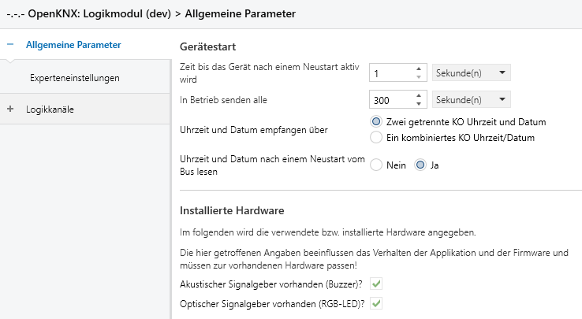</kbd>
Hier werden Einstellungen getroffen, die die generelle Arbeitsweise des Logikmoduls bestimmen.

Die Seite "Allgemeine Parameter" sieht bei jeder ETS-Applikation, die das Logikmodul verwendet, unterschiedlich aus, immer passend zu der verwendeten Hardwarekomponente, für die die ETS-Applikation geschrieben wurde. Somit müssen nicht alle im Folgenden aufgeführten Punkte vorhanden sein.

## Gerätestart

### **Zeit bis das Gerät nach einem Neustart aktiv wird**

Hier kann man festlegen, wie viel Zeit vergehen soll, bis das Gerät nach einem Neustart seine Funktion aufnimmt. Dabei ist es egal, ob der Neustart durch einen Busspannungsausfall, einen Reset über den Bus, durch ein Drücken der Reset-Taste oder durch den Watchdog ausgelöst wurde.

Da das Gerät prinzipiell (sofern parametriert) auch Lesetelegramme auf den Bus senden kann, kann mit dieser Einstellung verhindert werden, dass bei einem Busneustart von vielen Geräten viele Lesetelegramme auf einmal gesendet werden und so der Bus überlastet wird.

**Anmerkung:** Auch wenn man hier technisch bis zu 16.000 Stunden Verzögerung angeben kann, sind nur Einstellungen im Sekundenbereich sinnvoll.

### **In Betrieb senden alle**

Das Gerät kann einen Status "Ich bin noch in Betrieb" über das KO 1 senden. Hier wird das Sendeintervall eingestellt.

Sollte hier eine 0 angegeben werden, wird kein "In Betrieb"-Signal gesendet und das KO 1 steht nicht zur Verfügung.

### **Uhrzeit und Datum nach einem Neustart vom Bus lesen**

Dieses Gerät kann Uhrzeit und Datum vom Bus empfangen. Nach einem Neustart können Uhrzeit und Datum auch aktiv über Lesetelegramme abgefragt werden. Mit diesem Parameter wird bestimmt, ob Uhrzeit und Datum nach einem Neustart aktiv gelesen werden.

Wenn dieser Parameter gesetzt ist, wird die Uhrzeit und das Datum alle 20-30 Sekunden über ein Lesetelegramm vom Bus gelesen, bis eine entsprechende Antwort kommt. Falls keine Uhr im KNX-System vorhanden ist oder die Uhr nicht auf Leseanfragen antworten kann, sollte dieser Parameter auf "Nein" gesetzt werden.

### **Installierte Hardware**

Die Firmware im Logikmodul unterstützt eine Vielzahl an Hardwarevarianten. Um nicht für jede Hardwarekombination ein eigenes Applikationsprogramm zu benötigen, kann über die folgenden Felder die Hardwareausstattung des Logikmoduls bestimmt werden.

Die Angaben in diesem Teil müssen der vorhandenen Hardware entsprechen, da sie das Verhalten der Applikation und auch der Firmware bestimmen. Das Applikationsprogramm hat keine Möglichkeit, die Korrektheit der Angaben zu überprüfen.

Falsche Angaben können zu falschen Konfigurationen der Applikation und somit zum Fehlverhalten des Logikmoduls führen.

#### **Akustischer Signalgeber vorhanden (Buzzer)?**

Das Logikmodul unterstützt auch die Ausgabe von Pieptönen mittels eines Buzzers. Mit einem Haken in diesem Feld wird angegeben, ob ein Buzzer installiert ist.

Gleichzeitig wird ein Kommunikationsobjekt freigeschaltet, mit dem man die Soundausgabe sperren kann. Damit kann man verhindern, dass z.B. nachts Töne ausgegeben werden.

#### **Optischer Signalgeber vorhanden (RGB-LED)?**

Das Logikmodul unterstützt auch die Ausgabe eines Lichtsignals mittels einer RGB-LED. Mit einem Haken in diesem Feld wird angegeben, ob eine RGB-LED installiert ist.

Gleichzeitig wird ein Kommunikationsobjekt freigeschaltet, mit dem man die Lichtausgabe sperren kann. Damit kann man verhindern, dass z.B. nachts die LED leuchtet. Oder man schaltet die LED nur bei Präsenz ein und schont damit die Leuchtkraft der LED.

## **Experteneinstellungen**

<kbd>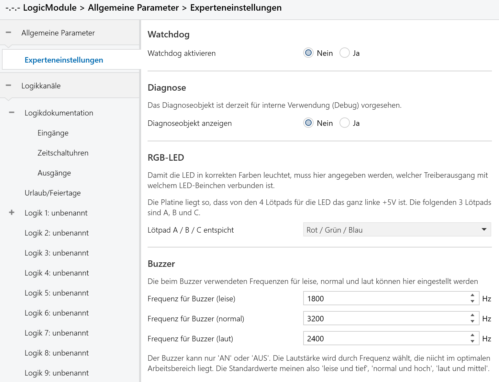</kbd>

Auf dieser Seite werden Einstellungen vorgenommen, die nicht so häufig gebraucht werden und die technisches Detailwissen erfordern

### **Watchdog**

Trotz hohen Qualitätsansprüchen, vielfältigen Tests und langem produktiven Einsatz kann man nie ausschließen, dass noch Fehler in der Firmware enthalten sind. Besonders ärgerlich sind Fehler, die ein Hardwaremodul zum hängen bringen und so die Funktion eingestellt wird.

Das Logikmodul bringt einen Watchdog mit, welcher es erlaubt, in Situationen, die einem "Hänger" entsprechen, die Hardware automatisch neu zu starten.

Der Vorteil eines Watchdog ist, dass er vor allem sporadische und selten vorkommende "Hänger" beseitigt, meist ohne dass man es merkt.

Der Nachteil ist, dass damit Fehler/Probleme verschleiert und umgangen werden, die besser an die Entwickler gemeldet und von ihnen gelöst werden sollten.

Damit der Watchdog funktioniert, muss bereits die Firmware mit der Einstellung

    -D WATCHDOG

in der platformio.ini gebaut worden sein (siehe Installationsanleitung).

#### **Watchdog aktivieren**

Mit einem 'Ja' wird der Watchdog eingeschaltet.

### **Diagnose**

Man kann mit dem Logikmodul ein Diagnoseobjekt (KO 7) einschalten. Dieses Diagnoseobjekt ist primär zum Debuggen vorhanden, kann aber auch einem User bei einigen Fragen weiter helfen.

Die Grundidee vom Diagnoseobjekt: Man sendet mit der ETS Kommandos an das KO 7 und bekommt eine entsprechende Antwort. Derzeit sind nur wenige Kommandos für die Nutzung durch den Enduser geeignet, allerdings werden im Laufe der Zeit immer weitere Kommandos hinzukommen und werden im Kapitel Diagnoseobjekt beschrieben.

#### **Diagnoseobjekt anzeigen**

Mit einem 'Ja' wird das KO 7 'Diagnoseobjekt' freigeschaltet.

### **RGB-LED**

Da RGB-LED unterschiedliche Pin-Belegungen für die Farben Rot, Grün und Blau haben, kann es passieren, dass man nach dem anlöten der LED feststellt, dass man falsche Farben präsentiert bekommt.

An dieser Stelle kann man die Pinbelegung für Rot/Grün/Blau in verschiedenen Permutationen einstellen und so softwareseitig mögliche Belegungsprobleme beseitigen.

### **Buzzer**

Das Logikmodul unterstützt 3 verschiedene Töne bzw. Lautstärken für den Buzzer.
In den Eingabefeldern kann man die Tonfrequenzen für die einzelnen Töne für Laut/Mittel und Leise angeben. Über die Tonhöhe werden indirekt auch die Lautstärken gesteuert.

## **Logikdokumentation**

Eine stichwortartige Abhandlung dieser Dokumentation ist auch in der Applikation enthalten und auf 3 Unterseiten aufgeteilt.

### **Allgemein**

Hier ist die generelle Funktionsweise des Logikmoduls beschrieben.

### **Eingänge**

Hier werden die Funktionsmodule für die Eingänge beschrieben.

### **Ausgänge**

Hier werden die Funktionsmodule für die Ausgänge beschrieben.

## **Urlaub/Feiertage**

Das Logikmodul hat eine Zeitschaltuhr-Funktion, die einige globale Einstellungen erfordert.

### **Zeit**

<kbd></kbd>

Für die korrekte Berechnung der Zeit für Sonnenauf- und -untergang werden die genauen Koordinaten des Standorts benötigt sowie auch die Zeitzone und die Information, ob eine Sommerzeitumschaltung intern vorgenommen werden soll.

Die Geo-Koordinaten können bei Google Maps nachgeschaut werden, indem man mit der rechten Maustaste auf das Objekt klickt und die unten erscheinenden Koordinaten benutzt.

Die Standard-Koordinaten stehen für Frankfurt am Main, Innenstadt.

#### **Breitengrad**

In dem Feld wird der Breitengrad des Standortes eingegeben.

#### **Längengrad**

In dem Feld wird der Längengrad des Standortes eingegeben.

#### **Zeitzone**

Für die korrekte Berechnung der Zeit wird die Zeitzone des Standortes benötigt. Es werden nur Zeitzonen für Europa angeboten.

#### **Sommerzeit berücksichtigen**

Mit einem "Ja" wird angegeben, dass die Umschaltung der Sommerzeit nicht vom Modul vorgenommen werden soll, sondern über den Bus auf dem KO 2 (Zeit) übertragen wird. Ein "Nein" führt zur internen Berechnung der Sommerzeit, das Modul geht davon aus, dass die Zeit auf dem Bus nicht die Sommerzeitverschiebung mitmacht (eher unüblich).

Wichtig: Für alle Schaltvorgänge wird die Uhrzeit vom Bus genommen, diese sollte somit in Lokalzeit vorliegen und idealerweise auch die Sommerzeitverschiebung beinhalten. Die Angaben für Zeitzone und Sommerzeit werden benötigt, um die Berechnung der Sonnenauf- und -untergangszeit anzupassen, da diese normalerweise immer in UTC erfolgen.

Wichtig: Sprünge in der von außen (über den Bus) vorgegebenen Zeit können vom Modul nicht erkannt und in irgendeiner Form berücksichtigt werden. Sollten also Modulzeit und Buszeit auseinanderlaufen (indem z.B. die Buszeit nur einmal pro Woche auf dem Bus ausgegeben wird), könnte es passieren, dass die Modulzeit z.B. um 10 Minuten zurückgesetzt wird. Schaltvorgänge, die in dieser Zeit erfolgt sind, werden dann erneut ausgeführt. Falls um 10 Minuten nach vorne gesprungen wird, werden die Zeiten übersprungen und nicht ausgeführt.

Das eben gesagte macht sich besonders bei der Sommerzeitumstellung bemerkbar, da dabei gewollt um eine Stunde gesprungen wird!

Empfehlung: Um solche "Sprung-" bzw. "Wiederholungseffekte" zu vermeiden, sollte man mindestens einmal pro Tag die Uhrzeit auf dem Bus ausgeben und an den Tagen der Sommerzeitumschaltung zwischen 2 und 3 Uhr morgens keine Schaltzeiten definieren.

### **Urlaub**

<kbd></kbd>

Zeitschaltuhren können Urlaubstage berücksichtigen, sofern diese Information vorliegt. Diese Information kann über ein Kommunikationsobjekt dem Modul mitgeteilt werden.

#### **Urlaubsbehandlung aktivieren?**

Mit einem "Ja" wird ein Kommunikationsobjekt freigeschaltet, über das ein Urlaubstag dem Modul mitgeteilt werden kann. Ein "EIN" besagt, dass der aktuelle Tag ein Urlaubstag ist.

#### **Nach Neustart Urlaubsinfo lesen?**

Erscheint nur, wenn "Urlaubsbehandlung aktivieren?" auf "Ja" steht.

Hier kann angegeben werden, ob nach einem Neustart des Moduls die Information, ob der aktuelle Tag ein Urlaubstag ist, vom Bus gelesen werden soll.

### **Feiertage**

Für die Zeitschaltuhren wird vom Modul eine Berechnung der Feiertage vorgenommen, inklusive einiger regionaler Feiertage.

<kbd></kbd>

#### **Feiertage auf dem Bus verfügbar machen?**

Ein "Ja" bei dieser Einstellung schaltet 2 Kommunikationsobjekte frei. Über diese Kommunikationsobjekte wird die Nummer eines Feiertags gesendet. Jede gesendete Nummer entspricht genau einem Feiertag, die Nummern entsprechen den in der Liste von Feiertagseinstellungen (siehe vorheriges Bild).

* KO 5 (Welcher Feiertag ist heute?) sendet, wenn der aktuelle Tag ein Feiertag ist,
* KO 6 (Welcher Feiertag ist morgen?) sendet, wenn der nächste Tag ein Feiertag ist.

Beide Kommunikationsobjekte (5 und 6) werden immer kurz nach Mitternacht (aber nicht exakt um Mitternacht) neu berechnet. Sie senden eine 0, wenn kein Feiertag ist und sich der Wert geändert hat.

#### **Nach Neuberechnung Feiertagsinfo senden?**

Erscheint nur, wenn "Feiertage auf dem Bus verfügbar machen?" auf "Ja" steht.

Hier kann angegeben werden, ob ein neuer Feiertag aktiv auf den Bus gesendet wird. Falls "Nein" eingestellt ist, wird der Feiertag trotzdem berechnet, muss aber mit einem Lese-Request aktiv vom KO gelesen werden.

#### **Auswahlfelder für Feiertage**

Es folgt eine Liste der dem Modul bekannten Feiertage. Durch Auswahlfelder kann bestimmt werden, ob dieser Feiertag bei der Feiertagsinfo und bei den Zeitschaltuhren berücksichtigt werden soll.

Es ist nicht möglich, eigene Feiertage in diese Liste aufzunehmen. Deswegen enthält die Liste auch eher unübliche Feiertage wie Rosenmontag oder 1 Advent, da diese Tage beweglich sind und somit berechnet werden müssen.

Man kann aber eine (oder mehrere) Jahresschaltuhren dafür verwenden, weitere Feiertage zu definieren und das Ergebnis dieser Zeitschaltuhr auf die Feiertags-GA zu senden.

## **Logikkanäle**

Im Folgenden werden die generellen Konzepte und die grobe Funktion eines Logikkanals beschrieben. Die Parameter eines jeden Kanals werden später im Detail beschrieben.

Jeder Logikkanal, von denen bis zu 80 zur Verfügung stehen, ist identisch aufgebaut. Es stehen immer 2 externe Eingänge, 2 interne Eingänge und ein Ausgang zur Verfügung. Alternativ kann als Eingang der Funktionsblock "Zeitschaltuhr" genutzt werden.

Zwischen die Eingänge und den Ausgang können verschiedene Funktionsblöcke geschaltet werden, die die Eingangssignale beeinflussen und Verknüpfen können und so ein Ausgangssignal erzeugen.

Alle Funktionsblöcke kann man sich wie an einer Perlenschnur aufgereiht hintereinander vorstellen, das Ergebnis eines Funktionsblocks wird für den darauffolgenden Funktionsblock als Eingabe verwendet.

<kbd>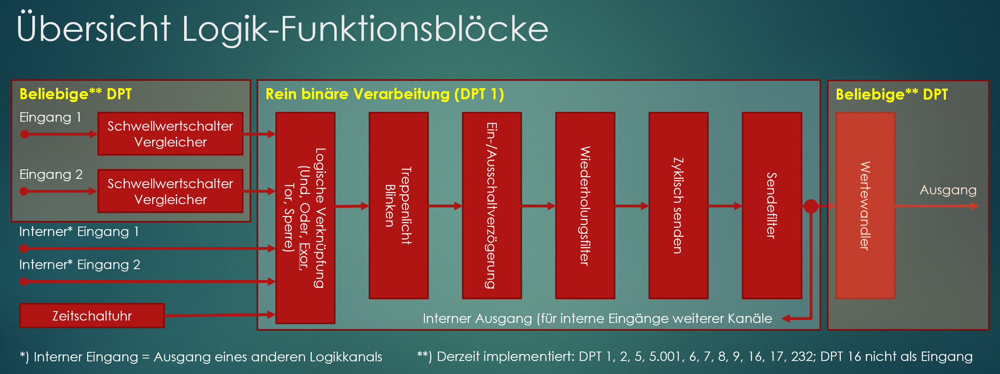</kbd>

Jeder Funktionsblock arbeitet rein binär, also nur mit den Werten 0 oder 1 (DPT 1). Damit auch andere DPT möglich sind, besitzen externe Eingänge Konverter-Funktionsblöcke, die von einem beliebigen DPT nach DPT 1 konvertieren. Derzeit sind Schwellwertschalter und Vergleicher als Konverterfunktionen implementiert. Interne Eingänge und die Zeitschaltuhr benötigen keinen Konverter, da sie rein binär funktionieren.

Die binäre Signalverarbeitung beginnt mit einer logischen Verknüpfung, die alle Eingänge zusammenbringt, gefolgt von

* Treppenlicht (mit einer Blinkfunktion)
* Ein- und Ausschaltverzögerung (getrennt einstellbar)
* Wiederholungsfilter
* Zyklisch senden
* Sendefilter

Wird ein Funktionsblock nicht genutzt (nicht parametrisiert), gibt er seine Eingabe unverändert als Ergebnis an den nächsten Funktionsblock weiter.

Das nach dem Sendefilter ermittelte Signal steht für die internen Eingänge der anderen Kanäle zur Verfügung. Ferner steht es auch einem Ausgangskonverter zur Verfügung, der als Wertwandler ausgelegt ist und den ermittelten Wert als einen anderen DPT ausgeben kann. Dabei können die Ausgabewerte festgelegt werden (Konstanten) oder ein am Eingang 1 oder Eingang 2 vorliegender Wert in den Ausgangs-DPT konvertiert werden.

### **Zeitschaltuhren**

Jeder Logikkanal kann statt interner oder externer Eingänge als Zeitschaltuhr-Kanal definiert werden. Dabei kann ein EIN- oder AUS-Signal anhand von bestimmten Zeitangaben erzeugt werden.

Es können bis zu 4 Jahresschaltpunkte (Tag/Monat/Stunde/Minute) oder 8 Tagesschaltpunkte (Wochentag/Stunde/Minute) pro Logikkanal definiert werden.

Folgende Zeitangaben sind möglich:

* Zeitpunkt (bis auf die Minute genau)
* Zeitpunkte an bestimmten Wochentagen
* Bestimmte Minuten jede Stunde
* Jede Minute zu bestimmten Stunden

Neben absoluten Zeitpunkten sind auch relative Zeitpunkte möglich:

* Zeitversatz (Stunde:Minute) relativ zum Sonnenauf-/-untergang
* Sonnenauf-/-untergang, aber frühstens um Zeitpunkt (Stunde:Minute)
* Sonnenauf-/-untergang, aber spätestens um Zeitpunkt (Stunde:Minute)

Für die korrekte Berechnung von Sonnenauf- und -untergangszeit muss das Modul die korrekten Geokoordinaten (Standort) des Hauses wissen, wie auch die Zeitzone und ob es an diesem Ort eine Sommerzeitumschaltung gibt. Diese Informationen muss man für die korrekte Funktion einstellen.

Ferner können Feiertage und Urlaubstage bei den Zeitpunkten berücksichtigt werden. Dabei kann bestimmt werden, ob die Schaltzeitpunkte:

* Urlaub/Feiertage nicht beachten sollen
* Bei Urlaub/Feiertag nicht schalten sollen
* Nur bei Urlaub/Feiertag schalten sollen
* Einen Urlaub/Feiertag wie Sonntag behandeln sollen

Dies erlaubt sehr flexible Zeitschaltuhren für Urlaub/Feiertage.

Zeitschaltuhren beginnen mit ihrer Funktion erst, nachdem mindestens einmal über den Bus Zeit und Datum gesetzt worden sind.

### **Startverhalten**

Dem Startverhalten eines Logikkanals kommt eine besondere Bedeutung zu.

Initial sind alle Eingänge und der Ausgang unbestimmt. Es wäre möglicherweise fatal, wenn beim Start jeder Logikkanal erst mal für seinen Ausgang ein AUS auf den Bus senden würde. Ebenso sollte eine UND-Verknüpfung mit 2 Eingängen, die auf Eingang 1 noch kein Signal empfangen hat und auf dem Eingang 2 eine 1 empfängt, nicht automatisch annehmen, dass Eingang 1 auf AUS steht und dadurch bedingt eine 0 auf den Ausgang senden.

Es muss einstellbar sein, wie ein Logikkanal mit "undefinierten" Zuständen umgeht. Im folgenden werden die Möglichkeiten für jeden Logikkanal erläutert.

Jeder Eingang ist beim Start undefiniert und der Ausgang sendet erst einmal nichts. Man kann für einen Eingang festlegen, wie er seinen Anfangswert bekommen soll.

Die einfachste Variante ist eine Konstantenbelegung: Ein Eingang kann den Wert AUS oder EIN annehmen und das kann man über Parameter festlegen. Anmerkung: Obwohl Eingänge durchaus verschiedene DPT unterstützen, ist die Vorbelegung nur mit den Werten AUS oder EIN möglich, also quasi als Ergebnis des Eingangskonverters.

Eine weitere Möglichkeit ist, dass der Eingang seinen Anfangswert vom Bus liest. Damit würde der Eingang bei einem Neustart ein Lesetelegramm schicken und auf eine Antwort warten. Bis die Antwort eintrifft, ist der Eingang weiterhin undefiniert. Da bei einem Systemstart andere Geräte, die das Lesetelegramm beantworten könnten, eventuell selbst noch nicht in der Lage sind zu senden, kann man zusätzlich zum Parameter "Allgemeine Parameter -> Zeit bis das Gerät nach einem Neustart aktiv wird" auch noch pro Kanal eine Startverzögerung festlegen. Das Lesetelegramm für diesen Kanal wird erst nach der Summe der beiden Zeiten gesendet.

Die letzte Möglichkeit, einen Eingang vorzubelegen, ist mit dem letzten Wert, den er hatte. Dazu kann man einstellen, dass der Wert für diesen Eingang über einen Stromausfall bzw. Reset des Gerätes hinweg in einem nichtflüchtigen Speicher gespeichert wird. Bei einem Neustart des Gerätes wird der Wert aus dem nichtflüchtigen Speicher wieder gelesen und als Startwert angenommen.

Das bisher beschriebene führt zu der Situation, dass ein Logikkanal nach einem Neustart, der Zeit bis das Gerät aktiv wird und der Zeit, bis der Kanal aktiv wird in einem Zustand sein kann, bei dem immer noch einer oder beide Eingänge undefiniert sind.

Eine Logikverknüpfung, die aber an einigen Eingängen einen definierten und and anderen Eingängen einen undefinierten Wert hat, muss wissen, wie sie sich in so einem Fall verhalten soll, sprich, ob und wie die Verknüpfung durchgeführt werden soll.

Hier sind 2 Möglichkeiten implementiert (und somit parametrisierbar):

1. Die Verknüpfung soll erst durchgeführt werden, wenn alle Eingänge definierte Werte haben. Bevor dies nicht eintritt, passiert am Ausgang einfach nichts.
2. Die Verknüpfung soll bereits beim Eintreffen des ersten Signals reagieren. Ist dann der andere Eingang noch undefiniert, kann man für diesen vernünftigerweise weder ein EIN noch ein AUS annehmen. Der undefinierte Eingang wird dann als nicht existent behandelt und die Verknüpfung nur für die definierten Eingänge durchgeführt. Beispiel: Ein UND mit 3 Eingängen, von denen 2 auf EIN und einer auf undefiniert stehen, würde wie ein UND mit 2 Eingängen behandelt werden und ein EIN liefern.

Bei Zeitschaltuhren sind keine weiteren Eingänge vorhanden, somit kann nach einem Neustart nur die Zeitschaltuhr für einen definierten Eingang sorgen. Dies geschieht automatisch mit dem Erreichen des nächsten Schaltpunkts. Eine weitere Möglichkeit ist die Einstellung "Beim Neustart letzte Schaltzeit nachholen". Diese Einstellung führt dazu, dass der Schaltzeitpunkt erneut ausgeführt wird, der direkt vor dem "jetzt"-Zeitpunkt liegt. Damit hat der Eingang dann einen definierten Zustand.

Durch die dezidierten Einstellungsmöglichkeiten des Startverhaltens pro Kanal kann man sein KNX-System sehr detailliert bezüglich des Systemstart steuern. Da genau dieses Startverhalten von vielen KNX-Geräten eher stiefmütterlich behandelt wird, hat man mit diesem Logikmodul viele Möglichkeiten, hier einzugreifen und Unzulänglichkeiten auszugleichen.

### **Zusammenfassung**

Die hier für jeden Kanal zur Verfügung stehenden Möglichkeiten der Beeinflussung des Signalverlaufs ermöglichen die Realisierung von vielen Steuerungsaufgaben, die sonst über viele Einzelgeräte oder gar Logikmaschinen verteilt werden müssen. Durch unterschiedliche Parametrierung der Funktionsblöcke kann man folgende klassische und im KNX übliche Funktionen erreichen:

* NOT (logische Negierung eines Signals)
* Logische Verknüpfung AND, OR, EXOR (durch die Nutzung von internen Eingängen auch mit sehr vielen Eingängen)
* TOR/Sperre (lasse nur ein Signal durch/nicht durch, solange ein anderes anliegt)
* Treppenlicht
* Ein- und Ausschaltverzögerung
* Zyklisch senden
* Schwellwertschalter
* Vergleichen von 2 Werten
* Intervallvergleich (Ein Wert liegt in einem bestimmten Wertebereich)
* Hysteresevergleich (Schalte EIN oberhalb eines Wertes, AUS erst unterhalb eines anderen)
* Wiederhole n mal ein Signal
* Vervielfache ein Signal auf verschiedene GA
* Konvertiere ein DPT in einen anderen
* Verzögere ein Signal
* Zeitschaltuhr-Funktionen
* tbc

## **Logik n: unbenannt**

Da alle Kanäle identisch sind, wird hier nur ein Kanal repräsentativ beschrieben. Das gesagte kann für alle Kanäle eingestellt werden.

Ein Logikkanal wird durch einen Tab mit dem Namen "Logik n: \<Name der Logik>" repräsentiert, wobei n die Nummer des Kanals ist und der \<Name der Logik> anfänglich "unbenannt" lautet.

<kbd>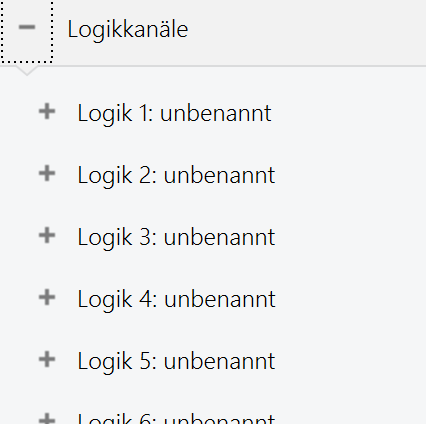</kbd>

Folgende Parameter kann man für einen Logikkanal angeben:

<kbd>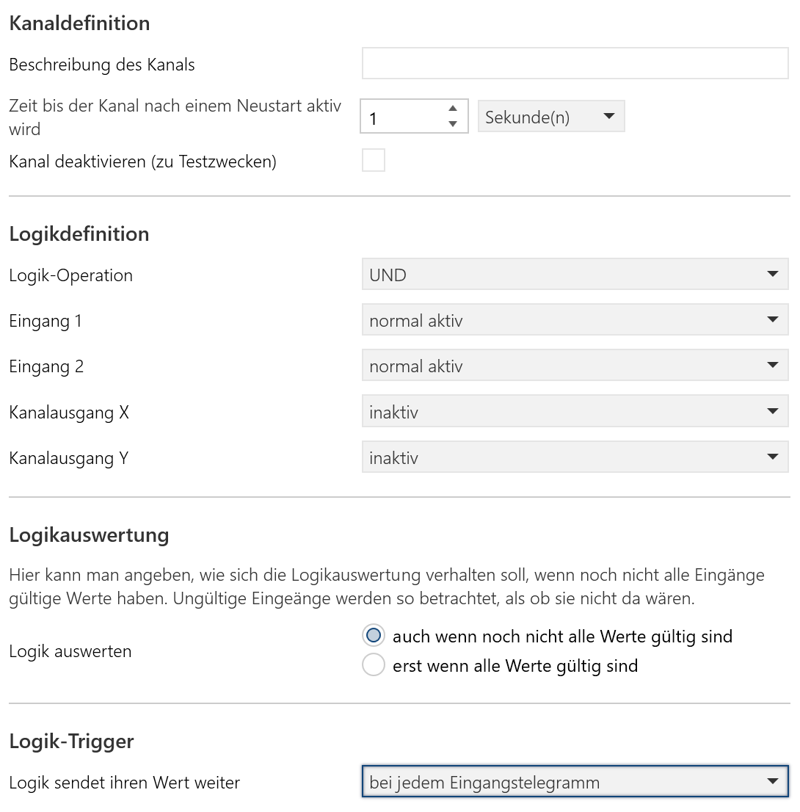</kbd>

## Kanaldefinition

Hier werden die Einstellungen vorgenommen, die für die Funktion des gesamten Kanals notwendig sind.

### **Beschreibung des Kanals**

Der hier vergebene Name hat keinen funktionalen Einfluss, erlaubt es aber, dem Kanal einen eigenen Namen zu geben, und ihn so leichter wiederzufinden. Der Name wird im Kanalbaum dargestellt und statt dem Text "unbenannt" genommen.

### **Zeit bis der Kanal nach einem Neustart aktiv wird**

Neben "Allgemeine Parameter -> Zeit bis das Gerät nach einem Neustart aktiv wird" kann auch noch pro Kanal eine Startverzögerung sinnvoll sein. Der Grund ist in "Logikkanäle -> Startverhalten" beschrieben.

Die Verzögerungszeit wird hier angegeben.

**Anmerkung:** Auch wenn man hier technisch bis zu 16.000 Stunden Verzögerung angeben kann, sind nur Einstellungen im Sekundenbereich sinnvoll.

### **Kanal deaktivieren (zu Testzwecken)**

Dieser Logikkanal ist außer Funktion. Er kann vollständig definiert sein und keine Einstellung geht verloren, aber der Ausgang wird kein Telegramm senden. Dies bietet die Möglichkeit, zu Testzwecken einen bereits parametrierten Logikkanal inaktiv zu setzen, um zu schauen, ob er die Ursache für eventuelles Fehlverhalten im Haus ist. Kann zur Fehlersuche hilfreich sein.

## Logikdefinition

Hier werden die Einstellungen vorgenommen, die für die Logikausführung selbst wesentlich sind.

<kbd>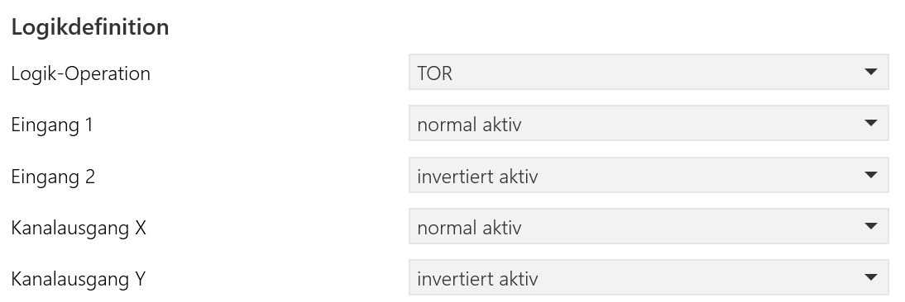</kbd>

### **Logik-Operation**

Mittels der Auswahlliste kann eine Operation und damit die Art der Verknüpfung der Eingänge dieses Logikkanals ausgewählt werden. Es stehen folgende Operationen zur Verfügung:

#### **aus**

Dieser Logikkanal nicht definiert und nicht aktiv. Es stehen keine Eingänge und kein Ausgang zur Verfügung. Alle entsprechenden KO sind ausgeblendet.

#### **UND**

Alle Eingänge werden über ein logisches UND verknüpft. Das Ergebnis der Verknüpfung ist EIN, wenn alle Eingänge des Funktionsblock EIN sind. Das Ergebnis ist AUS, wenn auch nur ein Eingang AUS ist.

#### **ODER**

Alle Eingänge werden über ein logisches ODER verknüpft. Das Ergebnis der Verknüpfung ist EIN, sobald nur ein Eingang des Funktionsblock EIN ist. Das Ergebnis ist AUS, wenn alle Eingänge AUS sind.

#### **EXKLUSIV-ODER**

Alle Eingänge werden über ein logisches Exklusiv-ODER verknüpft. Das Ergebnis der Verknüpfung ist EIN, wenn eine ungerade Anzahl von Eingängen des Funktionsblock EIN sind. Das Ergebnis ist AUS, wenn eine gerade Anzahl von Eingängen EIN sind.

#### **TOR**

Ein Tor hat normalerweise einen Dateneingang, Datenausgang und einen Toreingang. Wird das Tor über ein Signal am Toreingang geöffnet, können Daten vom Dateneingang zum Datenausgang fließen. Wird das Tor geschlossen, dann fließen keine Daten zwischen Dateneingang und Datenausgang.

Wird das Signal am Toreingang invertiert (negiert), dann sprechen wir von einer Sperre.

Da ein Logikkanal 4 Eingänge hat, ist bei einem Tor

    Dateneingang = Eingang 1 ODER Kanalausgang X
    Toreingang = Eingang 2 ODER Kanalausgang Y

(in Worten: Jeweils ein externer und ein interner Eingang werden über ein ODER verknüpft und bilden den entsprechenden Eingang der TOR-Verknüpfung).

#### **ZEITSCHALTUHR**

Dieser Logikkanal hat keine Eingänge, sondern repräsentiert eine Zeitschaltuhr. Der Ausgang wird somit durch entsprechende Zeitschaltpunkte geschaltet. Der Ausgang kann immer noch passende Funktionsmodule enthalten.

#### **SCHALTER (RS-FLIP_FLOP)**

Dieser Logikkanal hat den Eingang 1, der bei einem EIN-Signal den Ausgang EINschaltet. Der Eingang 2 schaltet bei einem EIN-Signal den Ausgang AUS. Ein AUS-Signal auf einem der beiden Eingänge bewirkt nichts. 

Mit dem Schalter lassen sich viele Funktionen, die vorher nur mit 2 Kanälen zu lösen waren, jetzt mit nur einem Kanal lösen, was die Übersichtlichkeit der Logiken erhöht. 

Der Schalter ermöglicht die Realisierung eines einfachen Szenen-Controllers (siehe Beispiele). Ferner können damit Hysterese-Logiken aufgebaut werden, bei denen die Ein- und Ausschaltbedingung aus 2 verschiedenen Quellen kommt (z.B. verschiedene DPT).

### **Eingang 1, Eingang 2**

Erscheint nur, wenn die Logik-Operation nicht auf "ZEITSCHALTUHR" gestellt wurde.

Jeder Eingang kann durch die Auswahlfelder deaktiviert bzw. normal oder invertiert (negiert) aktiviert werden.

#### **inaktiv**

Steht ein Eingang auf inaktiv, kann er nicht genutzt werden und es steht kein KO zur Verfügung, um ein Telegramm an diesen Eingang zu schicken.

#### **normal aktiv**

Für diesen Eingang erscheint ein Kommunikationsobjekt. Detailangaben zu diesem Eingang erfolgen auf einer eigenen Seite. Der aus den Einstellungen für den Eingang ermittelte binäre Wert wird direkt der oben ausgewählten logischen Operation zur Verfügung gestellt.

#### **invertiert aktiv**

Für diesen Eingang erscheint ein Kommunikationsobjekt. Detailangaben zu diesem Eingang erfolgen auf einer eigenen Seite. Der aus den Einstellungen für den Eingang ermittelte binäre Wert wird invertiert (negiert), bevor er der oben ausgewählten logischen Operation zur Verfügung gestellt wird. Invertieren (negieren) heißt, dass ein EIN-Signal zu einem AUS-Signal wird und umgekehrt.

### **Kanalausgang X, Kanalausgang Y**

Erscheint nur, wenn die Logik-Operation nicht auf ZEITSCHALTUHR gestellt wurde.

Auch wenn der Name es anders vermuten lässt, handelt es sich um interne Eingänge, die mit einem Ausgang eines anderen Kanals verbunden sind. Jeder interne Eingang kann durch die Auswahlfelder deaktiviert bzw. normal oder invertiert (negiert) aktiviert werden.

#### **inaktiv**

Steht ein interner Eingang auf inaktiv, kann er nicht genutzt werden und er hat keinen Einfluss auf die logische Verknüpfung.

#### **normal aktiv**

Es erscheint eine eigene Seite für die Verknüpfung dieses Eingangs mit einem anderen Kanalausgang. Der Wert des Kanalausgangs wird direkt der oben ausgewählten logischen Operation zur Verfügung gestellt.

#### **invertiert aktiv**

Es erscheint eine eigene Seite für die Verknüpfung dieses Eingangs mit einem anderen Kanalausgang. Der Wert des Kanalausgangs wird invertiert (negiert), bevor er der oben ausgewählten logischen Operation zur Verfügung gestellt wird. Invertieren (negieren) heißt, dass ein EIN-Signal zu einem AUS-Signal wird und umgekehrt.

## Logikauswertung

Hier werden die Einstellungen vorgenommen, die für die Auswertung der Logik relevant sind.

<kbd></kbd>

### **Logik auswerten**

Erscheint nur, wenn die Logik-Operation nicht auf ZEITSCHALTUHR gestellt wurde.

Wie bereits in "Logikkanäle -> Startverhalten" beschrieben, ist es notwendig, einer Logikverknüpfung zu sagen, wie sie mit undefinierten Eingängen umgehen soll.

#### **auch wenn noch nicht alle Werte gültig sind**

Die logische Verknüpfung betrachtet alle undefinierten Eingänge als ob sie mit "inaktiv" parametriert wären. Ein UND mit 3 Eingängen, das von den einer undefiniert ist, wird bereits ein EIN senden, wenn die 2 restlichen Eingänge EIN sind.

Ein TOR mit einem undefinierten Dateneingang oder einem undefinierten Toreingang kann nicht sinnvoll funktionieren und sendet dann gar nichts.

#### **erst wenn alle Werte gültig sind**

Die logische Verknüpfung wird erst dann einen Wert ermitteln, wenn an allen Eingängen gültige Werte vorliegen.

## Tordefinition

Hier wird das Verhalten vom Tor vorgegeben.

<kbd>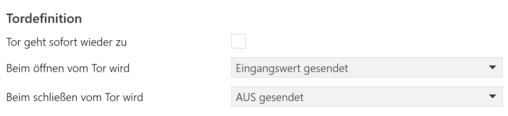</kbd>

### **Tor geht sofort wieder zu**

Ein Tor bleibt normalerweise offen, nachdem ein EIN-Telegramm am Toreingang empfangen wurde. Erst bei einem AUS-Telegramm am Toreingang geht das Tor wieder zu.

Wird "Tor geht sofort wieder zu" gewählt, geht das Tor beim Empfang eines EIN-Telegramms auf und danach sofort wieder zu. Es wird somit nicht auf ein AUS-Telegramm gewartet.

Man nennt einen solchen Eingang auch Impulseingang. Durch einen solchen Impulseingang kann man eine Taktung/Synchronisation der Werte erreichen, die am Eingang anliegen.

So kann z.B. ein Wert am Eingang, egal wie oft er sich ändert, nur jede Minute zum Ausgang durchgeschaltet werden. Oder ein Wert wird nur durchgelassen, wenn der Benutzer eine Taste betätigt.

Wenn man den Toreingang invertiert, kann man ein Tor realisieren, dass beim Empfang einer 0 kurz auf und sofort wieder zu geht.

> Abstrakt betrachtet entspricht ein Tor mit einem Impulseingang einem Tor mit einem normalen Eingang, vor den ein Treppenlicht geschaltet wurde, das sofort (z.B. nach 0.1 Sekunden) abläuft. Das Tor sendet dann nur beim öffnen, nichts beim schließen.

### **Beim öffnen vom Tor wird**

Das Auswahlfeld erscheint nur, wenn als logische Operation TOR gewählt wurde.

Mit dem Auswahlfeld kann man einstellen, ob das Tor zusätzliche Telegramme verschicken soll, wenn es gerade geöffnet wird (Toreingang geht auf EIN).

#### **nichts gesendet**

Beim öffnen vom Tor wird nichts gesendet, erst das nächste Telegramm am Dateneingang wird gesendet.

#### **AUS gesendet**

Beim öffnen vom Tor wird immer ein AUS-Signal gesendet.

#### **EIN gesendet**

Beim öffnen vom Tor wird immer ein EIN-Signal gesendet.

#### **Eingangswert gesendet**

Beim öffnen vom Tor wird der Eingangswert gesendet. Damit kann man erreichen, dass das letzte Signal, das vom Tor blockiert worden ist, nach dem öffnen doch noch durchkommt.

### **Beim schließen vom Tor wird**

Das Auswahlfeld erscheint nur, wenn als Logik-Operation TOR gewählt wurde und das Tor nicht sofort nach dem Öffnen geschlossen wird.

Mit dem Auswahlfeld kann man einstellen, ob das Tor zusätzliche Telegramme verschicken soll, wenn es gerade geschlossen wird (Toreingang geht auf AUS).

#### **nichts gesendet**

Beim schließen vom Tor wird nichts gesendet.

#### **AUS gesendet**

Beim schließen vom Tor wird immer ein AUS-Signal gesendet.

#### **EIN gesendet**

Beim schließen vom Tor wird immer ein EIN-Signal gesendet.

#### **Eingangswert gesendet**

Beim schließen vom Tor wird der Eingangswert gesendet. Da dieser Wert ja faktisch schon mal gesendet worden ist (als das Tor noch offen war), ist das effektiv eine einmalige Wiederholung des letzten Wertes.

## Logik-Trigger

Bisher wurde detailliert beschrieben, wie das Logik-Funktionsmodul die Eingänge auswertet, es ist aber ebenso wichtig zu bestimmen, wann der ermittelte Ausgangswert der Logik an die folgenden Funktionsmodule weitergeschickt wird.

<kbd></kbd>

### **Logik sendet ihren Wert weiter**

Diese Auswahlbox erlaubt eine Detaillierte Einstellung des Verhaltens.

#### **Nur bei geändertem Ergebnis**

Das Ergebnis der Logikauswertung wird nur dann weitergeschickt, wenn sich das Ergebnis geändert hat. Dazu wird das zuvor ermittelte Ergebnis der Logik (wichtig: nicht das Ergebnis am Ausgang des Logikkanals) herangezogen und mit dem aktuellen Ergebnis verglichen. Weicht es ab, wird das gerade ermittelte Ergebnis weitergeleitet.

#### **Nur bei geändertem Ergebnis, aber erstes Telegramm immer senden**

Diese Einstellung hat ein spezifisches Verhalten beim Neustart der Logik. Bei einem Neustart ist nicht klar, was "geändertes Ergebnis" heißt. Mit dieser Einstellung sagt man klar, dass das erste Ergebnis der Logik immer als "geändert" behandelt wird und so weitergeschickt wird. Gleichzeitig stellt das Ergebnis den Vergleichswert für die nächste Logikoperation dar, anhand dessen ein "geändertes Ergebnis" festgestellt werden kann.

#### **Nur bei geändertem Ergebnis, aber erstes Telegramm nicht senden**

Diese Einstellung hat ein spezifisches Verhalten beim Neustart der Logik. Bei einem Neustart ist nicht klar, was "geändertes Ergebnis" heißt. Mit dieser Einstellung sagt man klar, dass das erste Ergebnis der Logik immer als "nicht geändert" behandelt wird und somit nicht weitergeschickt wird. Gleichzeitig stellt das Ergebnis den Vergleichswert für die nächste Logikoperation dar, anhand dessen ein "geändertes Ergebnis" festgestellt werden kann.

#### **bei allen Eingangstelegrammen**

Sobald ein neues Eingangstelegramm eintrifft, wird das Ergebnis der logischen Verknüpfung ermittelt und an den nächsten Funktionsblock weitergeleitet.

#### **bei allen Eingangstelegrammen, aber erstes Telegramm nicht senden**

Sobald ein neues Eingangstelegramm eintrifft, wird das Ergebnis der logischen Verknüpfung ermittelt und an den nächsten Funktionsblock weitergeleitet. Allerdings wird das erste Telegramm nach einem Neustart unterdrückt. Damit kann man vermeiden, dass mögliche Statusmeldungen bei einem Neustart ungewollt Logiken bzw. Folgelogiken auslösen.

#### **bei folgenden Eingangstelegrammen**

<kbd>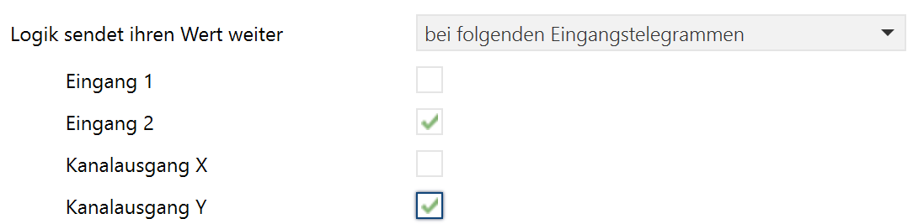</kbd>

Es erscheint eine Liste mit allen aktiven Eingängen. Man kann die Eingänge ankreuzen, auf die die Logikauswertung reagieren soll. Nur wenn ein Telegramm von einem dieser Eingänge kommt, wird die Logikauswertung angestoßen und das Ergebnis ermittelt und an den nächsten Funktionsblock weitergeleitet.

#### **bei folgenden Eingangstelegrammen, aber erstes Telegramm nicht senden**

Es erscheint eine Liste mit allen aktiven Eingängen. Man kann die Eingänge ankreuzen, auf die die Logikauswertung reagieren soll. Nur wenn ein Telegramm von einem dieser Eingänge kommt, wird die Logikauswertung angestoßen und das Ergebnis ermittelt und an den nächsten Funktionsblock weitergeleitet.
Allerdings wird das erste Telegramm nach einem Neustart unterdrückt. Damit kann man vermeiden, dass mögliche Statusmeldungen bei einem Neustart ungewollt Logiken bzw. Folgelogiken auslösen.

## **Eingang 1: unbenannt / Eingang 2: unbenannt**

Sobald für einen Logikkanal ein externer Eingang aktiviert wurde, erscheint für jeden Eingang eine Seite.

<kbd>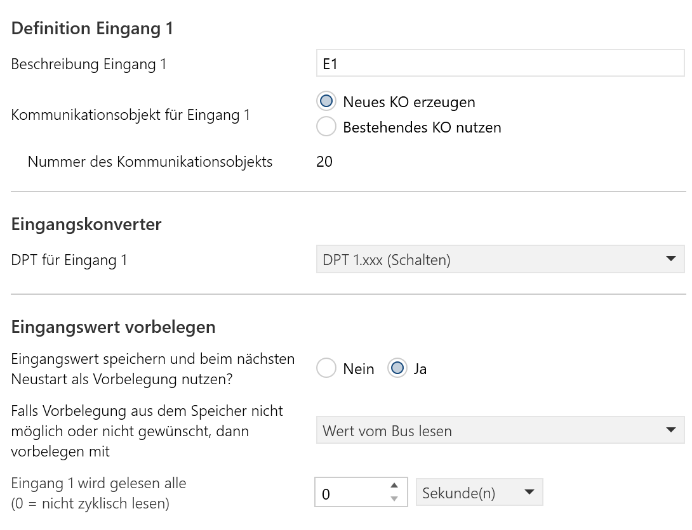</kbd>

## Definition Eingang 1

Jeder Eingang kann mit Hilfe der folgenden Einstellungen konfiguriert werden. Im Folgenden wird von Eingang n gesprochen, da die Beschreibung sowohl für Eingang 1 wie auch für Eingang 2 gilt.

> **Wichtig:** Wird ein Eingang als "invertiert aktiv" eingeschaltet, so passiert die Invertierung erst direkt bei der Wertübergabe an die logische Operation des Logik-Funktionsmoduls, also erst nach der Vorbelegung und nach dem Eingangskonverter.

### **Beschreibung Eingang n**

Dieses Feld hat keine funktionale Auswirkung. Es erlaubt den Eingang zu benennen und diesen so leichter wiederzufinden, erhöht somit die Übersichtlichkeit.

Der hier angegebene Text erscheint in der Seitenbeschreibung "Eingang n: unbenannt" statt dem Wort "unbenannt" und als Name des Kommunikationsobjektes, das zu diesem Eingang gehört.

### **Kommunikationsobjekt für Eingang 1**

Ein Eingang des Logikobjekts wird durch ein Kommunikationsobjekt repräsentiert. Dabei kann jedes Kommunikationsobjekt des Gerätes verwendet werden, auch KO, die nicht vom Logikmodul verwaltet werden. Dies ermöglicht, KO intern zu verbinden und so die Kommunikation auf dem Bus zu reduzieren. Eine solche interne Verbindung verhält sich genau so, als wäre der Eingang mit einer GA verbunden und Telegramme erhalten würde.

#### **Neues KO erzeugen**

Für den Eingang wird ein neues Kommunikationsobjekt erzeugt. Dieses KO ist somit komplett vom Logikmodul kontrolliert und verwaltet.

#### **Bestehendes KO nutzen**

Der Eingang wird durch ein existierendes Kommunikationsobjekt erzeugt. Das Kommunikationsobjekt wird somit anderweitig verwaltet, z.B. durch einen anderen Kanal oder eine andere Teilapplikation. Der Eingang "lauscht" somit nur auf die ankommenden Signale und kann keinerlei Aktionen an dem KO vornehmen, wie z.B. den DPT bestimmen oder Lese-Anforderungen verschicken.

### **Nummer des Kommunikationsobjekts**

Hier steht immer die Nummer des Kommunikationsobjekts, das als Eingang für diesen Kanal fungiert.

Falls ein neues Kommunikationsobjekt erzeugt wurde, ist die Nummer nicht änderbar und nur zur Information.

Falls ein bestehendes Kommunikationsobjekt genutzt werden soll, wird in dem Feld die Nummer des zu nutzenden Kommunikationsobjekts angegeben. Dieses KO muss existieren und es darf nicht ausgeblendet sein. Es muss keine GA mit dem Objekt verbunden sein.

## Eingangskonverter

Sobald für einen Eingang im Feld "DPT für Eingang n" etwas anderes als DPT 1 ausgewählt wird, erscheint ein DPT-Spezifischer Konverter, der eine Konvertierung in DPT 1 erlaubt. Dies ist zwingend notwendig, das die gesamte Logikverarbeitung nur mit binären Werten (DPT 1) erfolgt.

### **DPT für Eingang n**

Dieses Auswahlfeld legt den DPT für den Eingang fest. Unterstützt werden:

* DPT 1: binärer Wert
* DPT 2: Zwangsführung
* DPT 5: vorzeichenlose Zahl (0 bis 255)
* DPT 5.001: Prozentzahl (0 bis 100)
* DPT 6: vorzeichenbehaftete Zahl (-128 bis 127)
* DPT 7: vorzeichenlose Zahl (0 bis 65535)
* DPT 8: vorzeichenbehaftete Zahl (-32768 bis 32767)
* DPT 9: Gleitkommawert (-670760,96 bis 670760,96)
* DPT 17: Szenen Nummer (1-64)
* DPT 232: RGB-Wert (0-16777216)

Ist der DPT anders als DPT 1, erscheint je nach DPT ein Konverter, mit dem man den gewünschten Eingangs-DPT nach DPT 1 wandeln kann. Die gesamte weitere Verarbeitung des Eingangssignals erfolgt binär, also auf Basis von DPT 1.

> **Wichtig:** Wenn ein bestehendes Kommunikationsobjekt genutzt wird, muss der hier eingestellte DPT dem DPT des bestehenden KO entsprechen! Das kann nicht automatisch von der Applikation ermittelt werden. Wenn hier etwas falsch eingestellt wird und der falsche Eingangskonverter benutzt wird, kann der Logikkanal nicht korrekt funktionieren. Darauf wird in der Applikation durch die folgende Information hingewiesen:
<kbd></kbd>

### **DPT 1.xxx (Schalten)**

Für DPT 1 ist kein Konverter notwendig.

### **DPT 2.xxx (Zwangsführung)**

<kbd></kbd>

Eine Zwangsführung kann aus genau 4 Werten bestehen. Im Konverter kann eingestellt werden, welche dieser Werte, falls er empfangen wird, zu einem EIN-Signal konvertiert wird. Logischerweise führen alle hier nicht aufgeführten Werte zu einem AUS-Signal.

In dem Bildschirmausschnitt ist der Konverter so konfiguriert, dass "normal EIN" oder "priorität EIN" zu einem EIN-Signal führen, "normal AUS" oder "priorität AUS" zu einem AUS-Signal.

In den Auswahlfeldern können folgende Werte ausgewählt werden:

#### **nicht genutzt**

Dieses Eingabefeld wird nicht beachtet.

#### **normal AUS (00)**

Wird der Zwangsführungs-Wert "normal AUS" empfangen (im KNX durch eine 00 repräsentiert), dann wird dieser zu einem EIN-Signal konvertiert.

#### **normal EIN (01)**

Wird der Zwangsführungs-Wert "normal EIN" empfangen (im KNX durch eine 01 repräsentiert), dann wird dieser zu einem EIN-Signal konvertiert.

##### **priorität AUS (10)**

Wird der Zwangsführungs-Wert "priorität AUS" empfangen (im KNX durch eine 10 repräsentiert), dann wird dieser zu einem EIN-Signal konvertiert.

#### **priorität EIN (11)**

Wird der Zwangsführungs-Wert "priorität EIN" empfangen (im KNX durch eine 11 repräsentiert), dann wird dieser zu einem EIN-Signal konvertiert.

### **DPT 17.001 (Szene)**

<kbd></kbd>

Der Szenenkonverter kann bis zu 8 Szenennummern in eine EIN-Signal konvertieren. Alle anderen Szenennummern führen zu einem AUS-Signal. Sollten mehr Szenennummern benötigt werden, kann man mit einem weiteren Eingang oder einem weiteren Logikkanal jeweils 8 weitere Szenen einbeziehen.

In den Eingabefeldern werden die jeweiligen Szenennummern eingegeben, die zu einem EIN-Signal führen sollen. Der Wert "nicht genutzt" wird dann eingegeben, wenn das Eingabefeld nicht ausgewertet werden soll.

In dem Bildschirmausschnitt ist der Konverter so konfiguriert, dass aus Szene 6, 7 und 10 ein EIN-Signal generiert wird, aus allen anderen Szenen ein AUS-Signal.

### **Zahlenbasierte DPT**

Alle DPT, die Zahlen repräsentieren (das sind DPT 5.xxx, 5.001, 6.xxx, 7.xxx, 8.xxx, 9.xxx und 232.xxx), können mittels 4 verschiedenen Zahlenkonvertern  in ein binäres Signal umgewandelt werden. Die Zahlenkonverter sind alle gleich in ihren Einstellungen, die einzugebenden Zahlen müssen nur innerhalb der Wertebereiche des jeweiligen DPT liegen.

#### **Wert für Eingang n bestimmen durch**

Mit dem Auswahlfeld wird der passende Zahlenkonverter ausgewählt.

#### **Wertintervall**

<kbd>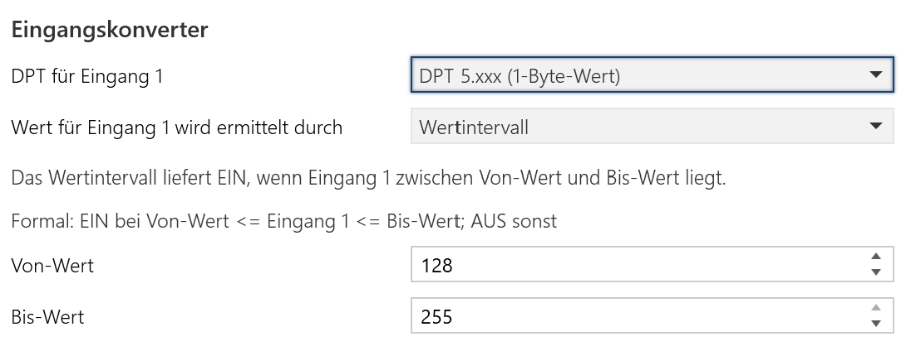</kbd>

Bei diesem Konverter legt man einen Von- und einen Bis-Wert fest. Wenn der Wert vom Eingang n innerhalb der Intervallgrenzen liegt (einschließlich der Grenzen selbst), wird er in ein EIN-Signal konvertiert, sonst in ein AUS-Signal.

Formal würde man schreiben:

    WENN Von-Wert <= Eingang n <= Bis-Wert DANN EIN SONST AUS

Falls man ein EIN-Signal möchte, wenn der Wert außerhalb des Intervalls liegt, muss man den Eingang invertiert einschalten.

In dem angezeigten Bildschirmausschnitt werden die Werte 0 bis 127 in ein AUS-Signal konvertiert, die Werte 128 bis 255 in ein EIN-Signal.

#### **Differenzintervall**

<kbd>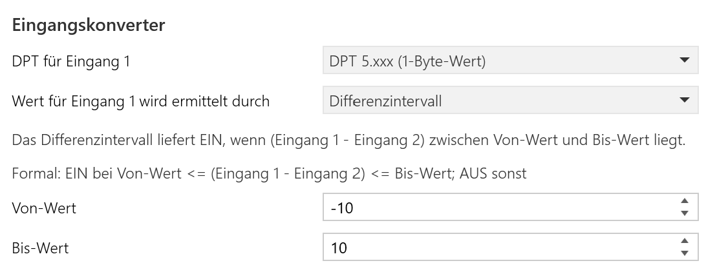</kbd>

Bei diesem Konverter legt man - wie beim Wertintervall - einen Von- und einen Bis-Wert fest. Der Wert, der mit diesem Intervall verglichen wird, ist allerdings die Differenz von dem Eingang n und dem anderen Eingang des Logikkanals. Bei Eingang 1 wird also (Eingang 1 - Eingang 2) gerechnet, bei Eingang 2 aber (Eingang 2 - Eingang 1). Wenn der errechnete Wert innerhalb der Intervallgrenzen liegt (einschließlich der Grenzen selbst), wird das Eingangssignal in eine EIN-Signal konvertiert, sonst in ein AUS-Signal.

Formal würde man (für Eingang 1) schreiben:

    WENN Von-Wert <= (Eingang 1 - Eingang 2) <= Bis-Wert DANN EIN SONST AUS

Falls man ein EIN-Signal möchte, wenn der Wert außerhalb des Intervalls liegt, muss man den Eingang invertiert einschalten.

In dem angezeigten Bildschirmausschnitt würde man bei Eingang 1 = 40 und Eingang 2 = 45 ein EIN-Signal bekommen, da 40 - 45 = -5 ist und dieser Wert innerhalb des Intervalls [-10;10] liegt.

Bei einem Differenzintervall muss der andere Eingang nicht vom gleichen DPT sein, er wird generisch in eine Zahl konvertiert. Allerdings kann das zu unerwarteten Ergebnissen führen. Empfohlen wird ein Differenzintervall für gleiche DPT.

Ein Differenzintervall kann auch als Vergleicher genutzt werden, in dem Von- und Bis-Wert auf 0 gesetzt werden. Dann wird nur bei einer Differenz = 0 (was nichts anderes als die Gleichheit der beiden Eingänge bedeutet) ein EIN-Signal erzeugt.

#### **Hysterese**

<kbd>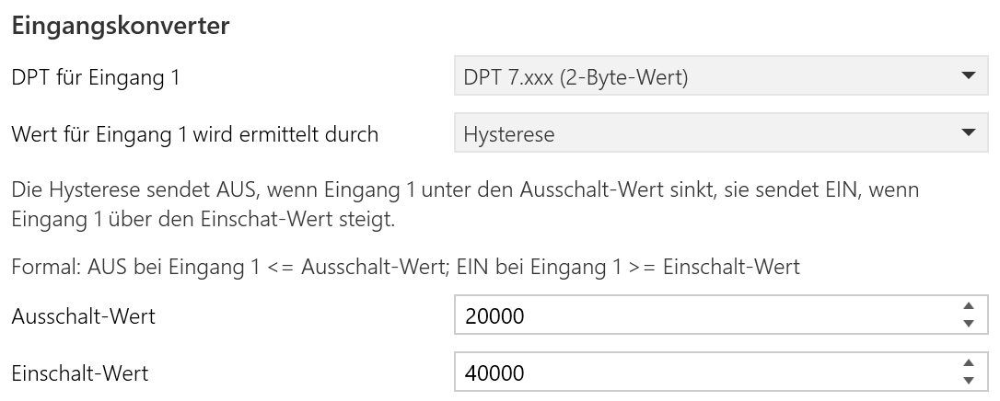</kbd>

Bei diesem Konverter legt man einen Einschalt- und einen Ausschalt-Wert fest. Der Einschaltwert sollte immer größer als der Ausschaltwert sein. Sobald der Wert vom Eingang n den Einschaltwert erreicht oder überschreitet, wird ein EIN-Signal erzeugt. Erst wenn der Wert wieder den Ausschaltwert erreicht oder diesen unterschreitet, wird ein AUS-Signal erzeugt.

Liegt der Wert zwischen dem Ein- und Ausschaltwert, so wird das zuletzt gültige Signal (EIN oder AUS) erzeugt. Falls vorher noch kein gültiges Signal erzeugt worden ist (z.B. beim Gerätestart), wird auch weiterhin kein Signal erzeugt. Somit beginnt ein Hysterese-Konverter nach einem Systemstart erst zu arbeiten, wenn einer der beiden Schwellwerte erreicht wurde.

Formal würde man schreiben:

    WENN Eingang n <= Ausschalt-Wert DANN AUS
    WENN Eingang n >= Einschalt-Wert DANN EIN

In dem angezeigten Bildschirmausschnitt könnte das ein Hystereseschalter für Helligkeit sein. Bei einer Helligkeit von mehr als 40000 Lux würde ein EIN-Signal erzeugt werden, das erst zu einem AUS-Signal führt, wenn die Helligkeit unter 20000 Lux sinkt.

#### **Differenzhysterese**

<kbd>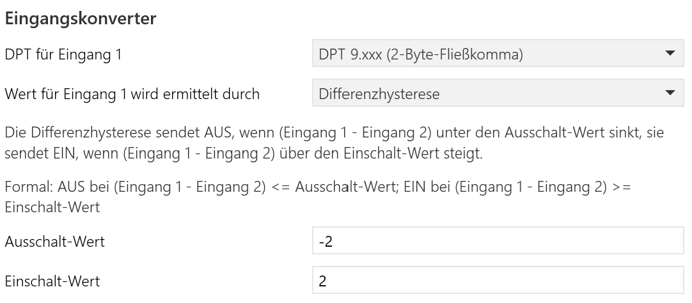</kbd>

Bei diesem Konverter legt man - wie bei der Hysterese - einen Einschalt- und einen Ausschalt-Wert fest. Der Wert, der mit den Grenzen verglichen wird, ist allerdings die Differenz von dem Eingang n und dem anderen Eingang des Logikkanals. Bei Eingang 1 wird also (Eingang 1 - Eingang 2) gerechnet, bei Eingang 2 aber (Eingang 2 - Eingang 1). Wenn der errechnete Wert den Einschaltwert erreicht oder überschreitet, wird ein EIN-Signal erzeugt. Erst wenn der errechnete Wert wieder den Ausschaltwert erreicht oder diesen unterschreitet, wird ein AUS-Signal erzeugt.

Liegt der Wert zwischen dem Ein- und Ausschaltwert, so wird das zuletzt gültige Signal (EIN oder AUS) erzeugt. Falls vorher noch kein gültiges Signal erzeugt worden ist (z.B. beim Gerätestart), wird auch weiterhin kein Signal erzeugt. Somit beginnt ein Hysterese-Konverter nach einem Systemstart erst zu arbeiten, wenn einer der beiden Schwellwerte erreicht wurde.

Formal würde man (z.B. für Eingang 1) schreiben:

    WENN (Eingang 1 - Eingang 2) <= Ausschalt-Wert DANN AUS
    WENN (Eingang 1 - Eingang 2) >= Einschalt-Wert DANN EIN

In dem angezeigten Bildschirmausschnitt könnte das ein Hystereseschalter für eine Zusatzheizung sein, bei der der Sollwert am Eingang 1 anliegt. Der Istwert am Eingang 2. Ist der Sollwert nun 2 Grad größer als der Istwert, wird ein EIN-Signal erzeugt. Erst wenn der Sollwert um 2 Grad kleiner als der Istwert ist, wird ein AUS-Signal erzeugt.

Die Differenzhysterese erlaubt eine Hysterese zu definieren, bei der man den Arbeitspunkt über den KNX-Bus einstellen kann.

### **Der "andere" Eingang bei Differenzkonvertern**

Zahlenbasierte Konverter können auch als Differenzkonverter genutzt werden. Dabei wird dann automatisch der "andere" Eingang aktiviert und für die Differenzberechnung genutzt.

Mit "anderer" Eingang ist folgendes gemeint:

* Für Eingang 1 ist der Differenzeingang der Eingang 2, es wird Eingang 1 - Eingang 2 gerechnet
* Für Eingang 2 ist der Differenzeingang der Eingang 1, es wird Eingang 2 - Eingang 1 gerechnet

Der Differenzeingang muss nicht vom gleichen DPT sein, er wird generisch in eine Zahl konvertiert. Allerdings kann das zu unerwarteten Ergebnissen führen. Empfohlen wird bei Differenzkonvertern der gleiche DPT.

Wird ein Differenzeingang genutzt, sollte dieser nicht auch noch als "normal aktiv" oder "invertiert aktiv" bei einer logischen Operation genutzt werden, obwohl das grundsätzlich möglich ist. Dann würde der Differenzeingang auch einen Konverter anbieten und entsprechend ein EIN- oder AUS-Signal für die logische Operation erzeugen. Dies ist ausdrücklich nicht empfohlen und auch bisher nicht getestet. Ob man die Komplexität eines solchen Aufbaus noch durchblicken kann, ist auch zu bezweifeln.

### **Ganzzahlbasierte DPT**

Alle DPT, die ganze Zahlen repräsentieren (das sind DPT 5.xxx, 5.001, 6.xxx, 7.xxx, 8.xxx), können mittels eines weiteren Einzelwert-Konverters in ein binäres Signal umgewandelt werden. Er ist gleich für alle DPT, die einzugebenden Zahlen müssen nur innerhalb der Wertebereiche des jeweiligen DPT liegen.

#### **Einzelwert-Konverter**

<kbd>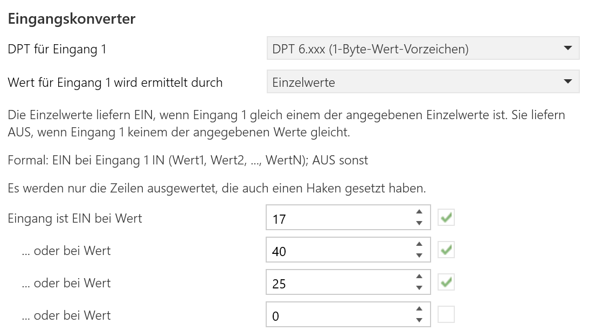</kbd>

Der Einzelwert-Konverter prüft, ob der Eingang einem der angegebenen Werte entspricht. Wenn ja, liefert der Eingang ein EIN-Signal an die Logik. Wenn er keinem der Werte entspricht, liefert er ein AUS-Signal. Geprüft wird jedes mal, wenn das Eingangs-KO einen Wert empfängt. Je nach DPT des Eingangs können unterschiedlich viele Werte geprüft werden:

DPT | Anzahl Werte
:---:|---:
DPT 5.xxx | 7 Werte
DPT 5.001 | 7 Werte
DPT 6.xxx | 7 Werte
DPT 7.xxx | 3 Werte
DPT 8.xxx | 3 Werte

Der Einzelwert-Konverter erspart einige ODER-Verknüpfungen und spart so Logikkanäle.

In dem angezeigten Bildschirmausschnitt wird bei den Werten 17, 25 und 40 ein EIN-Signal erzeugt, bei allen anderen Werten ein AUS-Signal.

#### **Konstanten**

Alle Eingänge können auch mit einem Konstanten Wert vorbelegt werden. Dies geschieht DPT gerecht, also passend zum Eingangs-DPT. Konstanten können in Formeln verwendet werden oder direkt von Ausgängen genutzt werden. Wobei man sowieso jeden Ausgang einen konstanten Wert senden lassen kann, insofern macht es keinen Sinn, konstante Eingänge für Ausgänge zu definieren.

<kbd>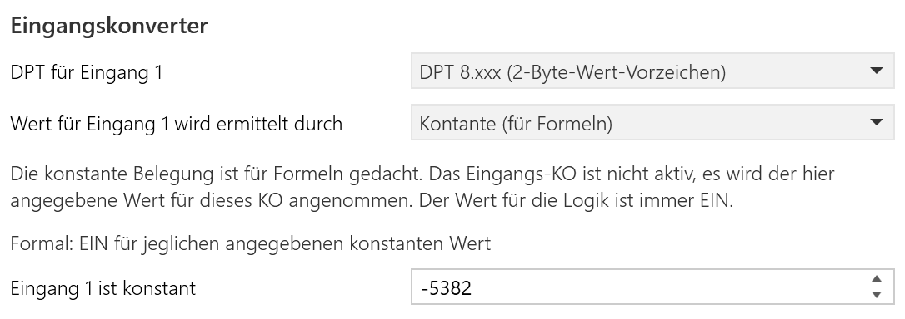</kbd>

Der Boolesche Wert einer Konstante ist immer EIN und kann in einer Logik normal genutzt werden. Natürlich ändert sich dieser Wert nie und kann auch keine Logik triggern.

Der Einsatz von Konstanten ist primär für Formeln gedacht. Wie die Konstanten der Eingänge in Formeln verwendet werden können, kann im Formel-Kapitel nachgelesen werden.

## Eingangswert vorbelegen

Die folgenden Einstellungen erlaubten ein dezidiertes Verhalten beim Neustart des Gerätes, wie im Kapitel "Logikkanäle -> Startverhalten" beschrieben.

<kbd>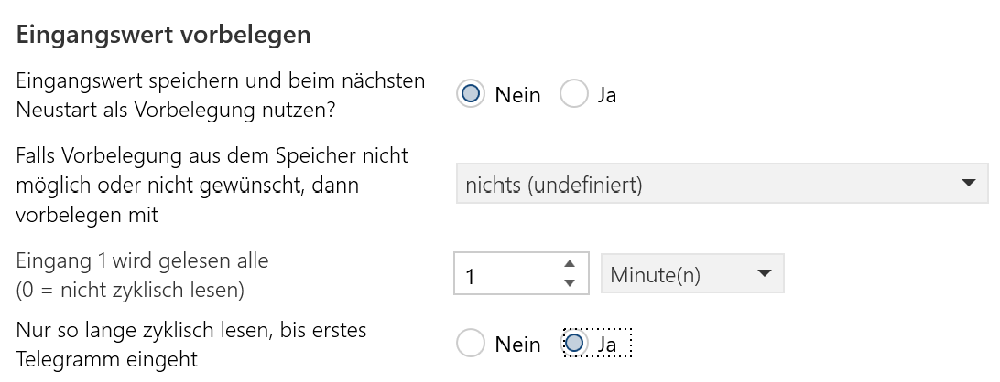</kbd>

### **Eingangswert speichern und beim nächsten Neustart als Vorbelegung nutzen**

Mit "Ja" legt man fest, dass der zuletzt an diesem Eingang empfangene Wert im nichtflüchtigen Speicher abgelegt wird und nach einem Neustart wieder gelesen wird. Der dann gelesene Wert wird als Vorbelegung für den Eingang genommen, falls nötig über den Eingangskonverter in einen DPT 1 konvertiert und dann die logische Operation getriggert.

Da nichtflüchtige Speicher nur eine relativ geringe Anzahl an Schreibzyklen zulassen, wird der Eingangswert nicht direkt nach dem Empfang im Speicher geschrieben, sondern erst beim Stromausfall, bei einem "Gerät zurücksetzen" über die ETS oder bei einer Neuprogrammierung über die ETS. Wird die RESET-Taste direkt am Gerät gedrückt, wird der nichtflüchtige Speicher nicht mit dem Eingangswert beschrieben.

> **Wichtig:** Das speichern der Werte in den nichtflüchtigen Speicher bei Stromausfall ist hardwareabhängig und wird nicht von jeder Hardware unterstützt. Auch in einem solchen Fall kann die Funktion sinnvoll sein, z.B. bie einem Neustart nach einer ETS-Programmierung, deswegen wird die Funktion immer angeboten. Ob ein Speichern beim Stromausfall unterstützt wird, steht (hoffentlich) in der Anleitung zum Hardware-Gerät, dass das Logikmodul verwendet.

> **Wichtig:** Es gibt 2 unterstützte Varianten von nichtflüchtigem Speicher: FLASH und EEPROM. Der FLASH-Speicher ist der gleiche, in dem die Firmware gespeichert wird und ist immer vorhanden. Standardmäßig wird in diesen Speicher gespeichert. Dies hat aber den Nachteil, dass bei einem Firmware-Update alle gespeicherten Werte verloren gehen. Falls die Werte im EEPROM gespeichert werden (Zusatzhardware), werden sie nicht durch ein Update der Firmware überschrieben.
Ob ein EEPROM installiert ist, wird von der Firmware automatisch festgestellt. Falls ein EEPROM vorhanden ist, wird dieses für die Speicherung von Werten genutzt.

### **Falls Vorbelegung aus dem Speicher nicht möglich oder nicht gewünscht, dann vorbelegen mit**

Dieses Auswahlfeld erlaubt eine Vorbelegung mit einem festgelegten Wert. Die Einstellung kommt aber nur zur Auswirkung, falls die vorhergehende Einstellung "Eingangswert speichern und beim nächsten Neustart als Vorbelegung nutzen" auf "Nein" steht oder der gespeicherte Wert nicht genutzt werden kann.

Es gibt einige wenige Gründe, warum ein gespeicherter Wert nicht genutzt werden kann:

* Der gespeicherte Wert hat einen anderen DPT. Das passiert, wenn man das Gerät mit der Einstellung "Speichern" in Benutzung hat, dann in der ETS den DPT für den Eingang ändert und das Gerät neu programmiert. Nach dem Neustart passen dann der gespeicherte DPT und der DPT vom Eingang nicht zusammen. Der gespeicherte Wert wird dann verworfen und die Einstellung dieses Feldes als Vorbelegung genommen.
* Es ist bisher gar kein Wert gespeichert worden, dann kann er natürlich auch nicht genutzt werden und stattdessen wird die Einstellung dieses Feldes als Vorbelegung genommen. Dies passiert immer, wenn man das erste Mal ein "Ja" beim "Eingangswert Speichern" geklickt hat.
* Es ist eine neue Firmware aufgespielt worden und die gespeicherten Werte wurden gelöscht. Das passiert immer, wenn die Werte im FLASH gespeichert werden.
* Durch einen Speicherfehler konnte vor einem Neustart der Wert vom Eingang nicht gespeichert werden. Auch dann wird die Einstellung dieses Feldes als Vorbelegung genutzt. Dieser Fall ist rein Theoretisch und noch nie in der Praxis aufgetreten.

Durch ein Einspielen einer neuen Applikation über die ETS werden die gespeicherten Werte im nichtflüchtigen Speicher nicht gelöscht.

#### **nichts (undefiniert)**

Der Eingang wird nicht vorbelegt und bleibt undefiniert, bis ein erstes Telegramm vom KNX-Bus empfangen wird.

#### **Wert vom Bus lesen**

Nach der eingestellten Startverzögerung für das gesamte Gerät zuzüglich der Startverzögerung für den Logikkanal wird ein Lesetelegramm auf den KNX-Bus geschickt. Bis die Antwort empfangen wurde ist der Eingang undefiniert.

Sollte in der Zeit, bis der Logikkanal startet, bereits ein Telegramm empfangen werden, dass das Lesetelegramm beantwortet hätte, wird das Lesetelegramm nicht gesendet. Damit wird verhindert, dass mehrere Eingänge, die mit der gleichen GA verbunden sind, viele Lesetelegramme auf die gleiche GA schicken.

#### **AUS (0)**

Der Eingang wird konstant mit einer 0 vorbelegt und hat somit sofort einen definierten Zustand.

#### **EIN (1)**

Der Eingang wird konstant mit einer 1 vorbelegt und hat somit sofort einen definierten Zustand.

### **Eingang wird alle n Sekunden gelesen (0=nicht zyklisch lesen)**

Manche Geräte können nicht von sich aus zyklisch senden. Hier kann man einstellen, dass ein Eingang aktiv den Wert zyklisch liest. In den Feld kann man angeben, wie viele Sekunden zwischen 2 Leseintervallen vergehen sollen.

### **Nur so lange zyklisch lesen, bis erstes Telegramm eingeht**

Erscheint nur, wenn bei "Eingang wird alle n Sekunden gelesen" ein Wert größer 0 eingegeben wurde.

Standardmäßig wird zyklisches lesen ununterbrochen durchgeführt. Mit einem 'Ja' kann man hier festlegen, dass nur so lange zyklisch gelesen wird, bis ein erstes Telegramm eingeht, dass den Wert bestimmt. Das kann sowohl ein Antworttelegramm (GroupValueResponse) wie auch ein Schreibtelegramm (GroupValueWrite) sein.

Diese Funktion wird vor allem nach einem Neustart des gesamten KNX-Busses von Nutzen sein, da Lesetelegramme womöglich nicht sofort beantwortet werden können, falls das antwortende Gerät sich selbst noch in der Startphase befindet. Hier kann man diese Lesetelegramme so lange wiederholen lassen, bis sie beantwortet werden können, anschließend kann ohne aktives Nachfragen auf normale Schreibtelegramme reagiert werden.

Dies erlaubt es, eine KNX-Anlage nach einem Neustart relativ schnell in einen Zustand zu versetzen, bei dem alle Initialisierungen erfolgt sind und alle Funktionen erwartungskonform ausgeführt werden.

> **Tipp:** Auch wenn die Logik selbst den gelesenen Wert nicht braucht, kann man mit der Funktion andere Geräte unterstützen, die selbst nicht nach einem Neustart lesen können. Denn auf das Antworttelegramm kann nicht nur das lesende Gerät reagieren, sondern alle Geräte am Bus.

## **Kanalausgänge verbinden**

Wird für eine logische Operation "Kanalausgang X" oder "Kanalausgang Y" als "normal aktiv" oder "invertiert aktiv" freigeschaltet, erscheint diese Seite.

Ausgänge von anderen Kanälen können dazu genutzt werden, große Logikblöcke zu bauen, ohne für jede Teillogik (jeden Logikkanal) eine eigene GA zur Verbindung von Eingang und Ausgang zu benötigen.

<kbd>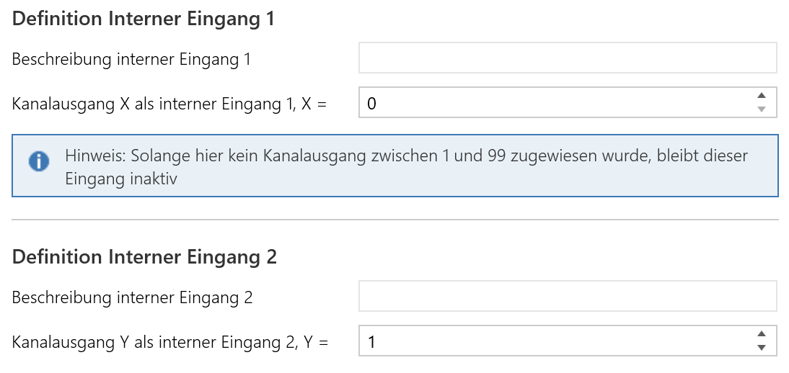</kbd>
Solange der Ausgang eines anderen Kanals nicht zugeordnet worden ist, wird der interne Eingang von der logischen Operation als undefiniert betrachtet.

## Definition Interner Eingang 1

Hier werden die Verbindungseinstellungen für den Internen Eingang 1 gewählt.

Erscheint nur, wenn bei der logischen Operation "Kanalausgang X" als "normal aktiv" oder "invertiert aktiv" ausgewählt wurde.

### **Beschreibung interner Eingang 1**

Diese Feld erlaubt eine kurze Beschreibung, wozu dieser Eingang verwendet wird. Es hat keinen Einfluss auf die Funktion des Eingangs und dient rein zu Dokumentationszwecken.

### **Kanalausgang X als Eingang, X** =

Als Eingabe wird hier die Nummer der Logik erwartet, deren Ausgang als interner Eingang genutzt werden soll. Solange der Eingang nicht verbunden ist (Wert im Eingabefeld ist 0) erscheint eine Warnmeldung, dass der Eingang inaktiv (undefiniert) ist.

Es kann auch der Ausgang des aktuellen Kanals als interner Eingang verwendet werden. Da dies aber schwer abzusehende Seiteneffekte haben kann, die im Falle einer Schleife auch den Bus mit vielen Telegrammen fluten können, erscheint in einem solchen Fall eine Warnung:
<kbd>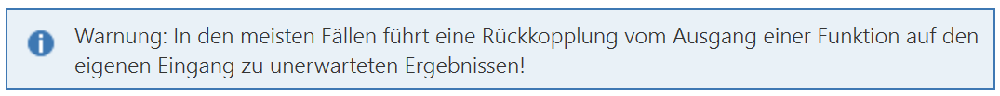</kbd>

## Definition Interner Eingang 1

Hier werden die Verbindungseinstellungen für den Internen Eingang 2 gewählt.

Erscheint nur, wenn bei der logischen Operation "Kanalausgang Y" als "normal aktiv" oder "invertiert aktiv" ausgewählt wurde.

### **Beschreibung interner Eingang 2**

Diese Feld erlaubt eine kurze Beschreibung, wozu dieser Eingang verwendet wird. Es hat keinen Einfluss auf die Funktion des Eingangs und dient rein zu Dokumentationszwecken.

### **Kanalausgang Y als Eingang, Y =**

Als Eingabe wird hier die Nummer der Logik erwartet, deren Ausgang als interner Eingang genutzt werden soll. Solange der Eingang nicht verbunden ist (Wert im Eingabefeld ist 0) erscheint eine Warnmeldung, dass der Eingang inaktiv (undefiniert) ist.

Es kann auch der Ausgang des aktuellen Kanals als interner Eingang verwendet werden. Da dies aber schwer abzusehende Seiteneffekte haben kann, die im Falle einer Schleife auch den Bus mit vielen Telegrammen fluten können, erscheint in einem solchen Fall eine Warnung:
<kbd></kbd>

## **Schaltzeiten: unbenannt**

Erscheint nur, wenn die Logik-Operation auf ZEITSCHALTUHR gestellt wurde.

Auf dieser Seite können die Schaltpunkte für eine Zeitschaltuhr eingegeben werden. Die Einstellmöglichkeiten sind bei jedem Logikkanal gleich, so dass nur ein Kanal beschrieben wird.

<kbd>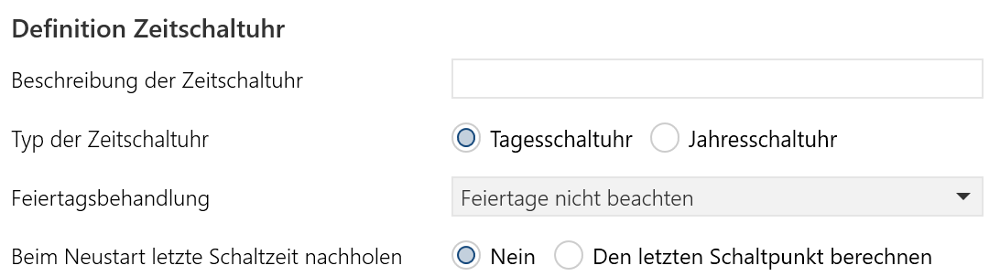</kbd>

## Definition Zeitschaltuhr

In diesem Bereich wird das generelle Verhalten der Zeitschaltuhr definiert.

### **Beschreibung der Zeitschaltuhr**

Diese Feld erlaubt eine kurze Beschreibung, wozu diese Zeitschaltuhr verwendet wird. Es hat keinen Einfluss auf die Funktion und dient rein zu Dokumentationszwecken. Der Text wird in der Seitenbeschreibung statt dem Wort "unbenannt" genommen und erlaubt so ein einfacheres wiederfinden der Zeitschaltuhr.

### **Typ der Zeitschaltuhr**

Es werden genau 2 Typen von Zeitschaltuhren unterstützt:

* Tagesschaltuhr: Erlaubt die Angabe von Wochentag, Stunde und Minute und ist somit für tägliche/wöchentliche Schaltungen gedacht. Diese Schaltuhr erlaubt 8 Schaltzeiten zu definieren.
* Jahresschaltuhr: Erlaubt die Angabe von Monat, Tag, Wochentag, Stunde und Minute und ist somit für seltener im Jahr/Monat vorkommende Schaltungen gedacht. Diese Schaltuhr erlaubt 4 Schaltzeiten zu definieren.

Sollten die Schaltzeiten einer Zeitschaltuhr nicht ausreichen, kann man mehrere Kanäle als Zeitschaltuhr definieren und diese dann per ODER verknüpfen.

### **Feiertagsbehandlung**

Über dieses Auswahlfeld kann man definieren, wie sich die Zeitschaltuhr (also alle Schaltpunkte) bei einem Feiertag verhalten.

#### **Feiertage nicht beachten**

Für diese Zeitschaltuhr ist die Feiertagsinformation nicht relevant. Ein Feiertag wird nicht beachtet, die Schaltzeitpunkte werden normal ausgeführt.

#### **An Feiertagen nicht schalten**

An einem Feiertag wird diese Zeitschaltuhr ignoriert und nicht ausgeführt. Dies ist dann eine Zeitschaltuhr für "normale" Tage.

#### **Nur an Feiertagen schalten**

Diese Zeitschaltuhr wird nur an einem Feiertag ausgeführt und nicht an anderen Tagen. Somit ist dies eine Zeitschaltuhr für reine Feiertage.

#### **Feiertage wie Sonntage behandeln**

Bei dieser Zeitschaltuhr werden die Schaltzeiten normal behandelt, an einem Feiertag werden aber die Schaltzeiten für einen Sonntag ausgeführt, unabhängig von dem Wochentag des Feiertages.

### **Urlaubsbehandlung**

Erscheint nur, wenn unter "Urlaub/Feiertage" die Einstellung "Urlaubsbehandlung aktivieren?" mit "Ja" eingestellt wurde.

Über dieses Auswahlfeld kann man definieren, wie sich die Zeitschaltuhr (also alle Schaltpunkte) bei einem Urlaubstag verhalten. Ein Urlaubstag muss dem Modul extern über das KO 4 mitgeteilt werden.

#### **Urlaub nicht beachten**

Für diese Zeitschaltuhr ist die Urlaubsinformation nicht relevant. Ein Urlaubstag wird nicht beachtet, die Schaltzeitpunkte werden normal ausgeführt.

#### **Bei Urlaub nicht schalten**

An einem Urlaubstag wird diese Zeitschaltuhr ignoriert und nicht ausgeführt. Dies ist dann eine Zeitschaltuhr für "normale" Tage.

#### **Nur bei Urlaub schalten**

Diese Zeitschaltuhr wird nur an einem Urlaubstag ausgeführt und nicht an anderen Tagen. Somit ist dies eine Zeitschaltuhr für reine Urlaubstage.

#### **Urlaub wie Sonntag behandeln**

Bei dieser Zeitschaltuhr werden die Schaltzeiten normal behandelt, an einem Urlaubstag werden aber die Schaltzeiten für einen Sonntag ausgeführt, unabhängig vom Wochentag des Urlaubstages.

### **Bei Neustart letzte Schaltzeit nachholen**

Nach einem Neustart des Moduls kann die letzte Schaltzeit erneut ausgeführt werden. Sobald das Datum und die Uhrzeit erstmals über den Bus gesetzt worden sind, wird nach der spätesten Schaltzeit gesucht, die noch vor dem aktuellen Datum/Uhrzeit liegt. Dieser Schaltzeitpunkt wird dann ausgeführt.

Da eine Nachberechnung aller Schaltzeiten für bis zu 80 Zeitschaltuhren inklusive Feiertagsbehandlung direkt nach dem ersten Setzen der Zeit über den Bus sehr lange dauern würde und in dieser Zeit (mehrere Sekunden) die Funktion des Moduls gestört wäre, wird die Nachberechnung der Schaltzeiten durch einen Nebenprozess während der normalen Funktion des Moduls durchgeführt. Der Nebenprozess funktioniert in kleinen Schritten, die wenig Rechenzeit kosten und die Normalfunktion nicht behindern. Als Konsequenz kann es etwas dauern, bis der entsprechende nachberechnete Zeitschaltpunkt nachgeholt wird.

Wie lange es dauert, bis ein nachberechneter Zeitschaltpunkt nachgeholt wird, hängt wiederum vom Zeitschaltpunkt selbst ab.

Der Nebenprozess wird pro Sekunde zweimal aufgerufen und geht dabei jeweils einen weiteren Tag zurück, berechnet für diesen Tag die Feiertage und prüft für jede Zeitschaltuhr, die bisher noch keinen definierten Ausgangswert hat (sie könnte ja schon von sich aus im Rahmen der Normalfunktion geschaltet haben), ob diese Zeitschaltuhr an diesem Tag schalten sollte. Wenn ja, dann schaltet diese Zeitschaltuhr mit dem für diesen Tag zeitlich spätesten Wert. Damit ist der zeitlich späteste Schaltpunkt vor dem Modulneustart gegeben.

Obiges bedeutet, dass der Nebenprozess für Tagesschaltuhren, die auch Wochentage enthalten können, bis zu 3 Sekunden benötigen kann, um eine (Tages-)Schaltzeit nachzuholen, da er 2 Tage pro Sekunde zurückgeht.

Bei Jahresschaltuhren wird der späteste Schaltzeitpunkt, der nachberechnet wurde, 366 / 2 = 183 Sekunden nach dem ersten setzen der Zeit über den Bus erreicht, also etwa 3 Minuten nach dem Neustart. Dies ist ein theoretischer Wert, da in diesem Fall der Schaltzeitpunkt vor einem Jahr liegen müsste und sich zwischendurch nicht geändert hat. Da man meistens aber einen Schaltzeitpunkt für EIN und einen für AUS definiert, wird bei Jahresschaltzeiten wahrscheinlich einer der Schaltzeitpunkte bereits früher erreicht.

Der Nebenprozess beendet sich selbst, sobald alle Zeitschaltuhren einen definierten Ausgangswert haben.

> **Achtung:** Zeitschaltuhren, die Urlaubstage berücksichtigen, können bei der Nachberechnung der Zeitschaltpunkte nicht mit einbezogen werden, da die Information "Urlaubstag" per KO von extern dem Modul über den Bus gemeldet wird und somit nicht für die (historische) Nachberechnung zur Verfügung steht. Somit werden bei der Nachberechnung alle Zeitschaltuhren mit einer anderen Angabe als "Urlaub nicht beachten" ignoriert.

## Schaltzeitpunkte Tagesschaltuhr

Schaltzeitpunkte werden in einer Tabelle definiert, eine Zeile per Schaltpunkt. Im folgenden werden nur die Eingaben einer Zeile erklärt, da alle Zeilen gleich definiert werden.

Im folgenden werden die Spalten der Tagesschaltuhr beschrieben.

<kbd>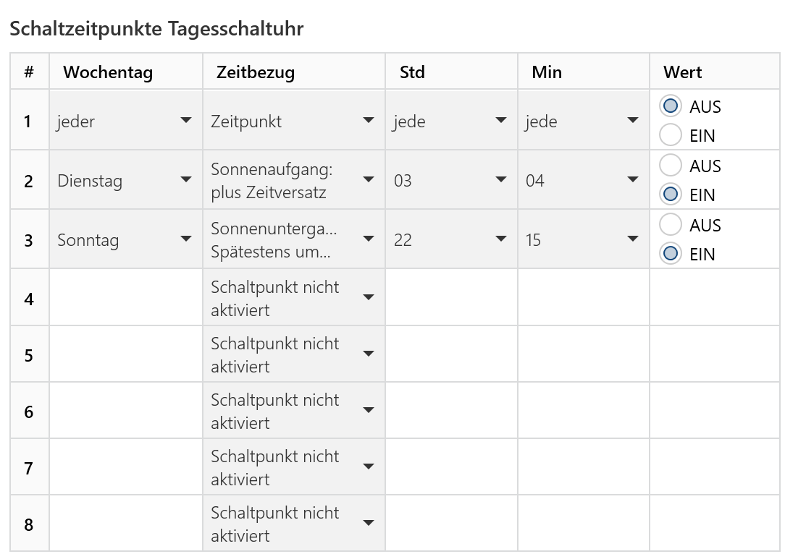</kbd>

### **Spalte: Zeitbezug**

Ist sowohl bei Tagesschaltuhr und Jahresschaltuhr vorhanden.

Hier wird angegeben, wie eine Zeitangabe interpretiert werden soll. Je nach Einstellung dieses Feldes wirken sich Zeitangaben in den Spalten Stunde und Minute unterschiedlich aus.

#### **Schaltpunkt nicht aktiviert**

Dieser Schaltpunkt ist nicht aktiv und wird nicht ausgewertet.

#### **Zeitpunkt**

Es wird ein Zeitpunkt bestimmt, zu dem geschaltet werden soll. Die Angabe des Zeitpunktes erfolgt über die Spalten Stunde und Minute.

#### **Sonnenaufgang: plus Zeitversatz**

Der Schaltzeitpunkt ist der Sonnenaufgang, zu dem die Zeitangabe, die in den Spalten Stunde und Minute steht, hinzuaddiert wird. Es wird somit um die angegebenen Stunden und Minuten nach Sonnenaufgang geschaltet.

#### **Sonnenaufgang: minus Zeitversatz**

Der Schaltzeitpunkt ist der Sonnenaufgang, von dem die Zeitangabe, die in den Spalten Stunde und Minute steht, abgezogen wird. Es wird somit um die angegebenen Stunden und Minuten vor Sonnenaufgang geschaltet.

#### **Sonnenaufgang: Frühestens um**

Der Schaltzeitpunkt ist der Sonnenaufgang oder die Uhrzeit, die in den Spalten Stunde und Minute steht. Geht die Sonne vor der angegebenen Uhrzeit auf, wird erst um die angegebene Uhrzeit geschaltet, sonst erst beim Sonnenaufgang. Es wird somit beim Sonnenaufgang, aber nicht früher als die angegebene Uhrzeit geschaltet.

#### **Sonnenaufgang: Spätestens um**

Der Schaltzeitpunkt ist der Sonnenaufgang oder die Uhrzeit, die in den Spalten Stunde und Minute steht. Geht die Sonne nach der angegebenen Uhrzeit auf, wird bereits um die angegebene Uhrzeit geschaltet, sonst schon beim Sonnenaufgang. Es wird somit beim Sonnenaufgang, aber nicht später als die angegebene Uhrzeit geschaltet.

#### **Sonnenuntergang: plus Zeitversatz**

Der Schaltzeitpunkt ist der Sonnenuntergang, zu dem die Zeitangabe, die in den Spalten Stunde und Minute steht, hinzuaddiert wird. Es wird somit um die angegebenen Stunden und Minuten nach Sonnenuntergang geschaltet.

#### **Sonnenuntergang: minus Zeitversatz**

Der Schaltzeitpunkt ist der Sonnenuntergang, von dem die Zeitangabe, die in den Spalten Stunde und Minute steht, abgezogen wird. Es wird somit um die angegebenen Stunden und Minuten vor Sonnenuntergang geschaltet.

#### **Sonnenuntergang: Frühestens um**

Der Schaltzeitpunkt ist der Sonnenuntergang oder die Uhrzeit, die in den Spalten Stunde und Minute steht. Geht die Sonne vor der angegebenen Uhrzeit unter, wird erst um die angegebene Uhrzeit geschaltet, sonst erst beim Sonnenuntergang. Es wird somit beim Sonnenuntergang, aber nicht früher als die angegebene Uhrzeit geschaltet.

#### **Sonnenuntergang: Spätestens um

Der Schaltzeitpunkt ist der Sonnenuntergang oder die Uhrzeit, die in den Spalten Stunde und Minute steht. Geht die Sonne nach der angegebenen Uhrzeit unter, wird bereits um die angegebene Uhrzeit geschaltet, sonst schon beim Sonnenuntergang. Es wird somit beim Sonnenuntergang, aber nicht später als die angegebene Uhrzeit geschaltet.

### **Spalte: Stunde**

Ist sowohl bei Tagesschaltuhr und Jahresschaltuhr vorhanden.

In dieser Spalte werden Stunden eingestellt, entweder als absolute Uhrzeit oder als Versatz zum Sonnenauf- oder -untergang.

Wird hier der Wert "jede" ausgewählt, wird der Schaltpunkt jede Stunde ausgeführt, natürlich unter Berücksichtigung der angegebenen Minuten. So kann man stündlich wiederkehrende Aktionen definieren. Der Wert "jede" steht nur zur Verfügung, wenn der Zeitbezug auf "Zeitpunkt" steht.

### **Spalte: Minute**

Ist sowohl bei Tagesschaltuhr und Jahresschaltuhr vorhanden.

In dieser Spalte werden Minuten eingestellt, entweder als absolute Uhrzeit oder als Versatz zum Sonnenauf- oder -untergang.

Wird hier der Wert "jede" ausgewählt, wird der Schaltpunkt jede Minute ausgeführt, natürlich unter Berücksichtigung der angegebenen Stunde. So kann man minütlich wiederkehrende Aktionen definieren. Der Wert "jede" steht nur zur Verfügung, wenn der Zeitbezug auf "Zeitpunkt" steht.

### **Spalte: Wert**

Ist sowohl bei Tagesschaltuhr und Jahresschaltuhr vorhanden.

In dieser Spalte wird der Wert eingestellt, den der Schaltpunkt senden soll. Dieser (rein boolesche) Wert durchläuft dann das normale Ausgangs-Processing des Logikkanals und steht am Ausgangs-KO zur Verfügung.

### **Spalte: Wochentag**

Ist nur bei der Tagesschaltuhr vorhanden.

In dieser Spalte wird der Wochentag eingestellt, an dem der Schaltpunkt ausgeführt werden soll. Es kann nur genau ein Wochentag ausgewählt werden.

Wird hier der Wert "jeder" ausgewählt, wird der Schaltpunkt an jedem Wochentag ausgeführt, natürlich unter Berücksichtigung der restlichen Angaben. So kann man täglich wiederkehrende Aktionen definieren.

## Schaltzeitpunkte Jahresschaltuhr

Im folgenden werden die Spalten der Jahresschaltuhr beschrieben.

<kbd>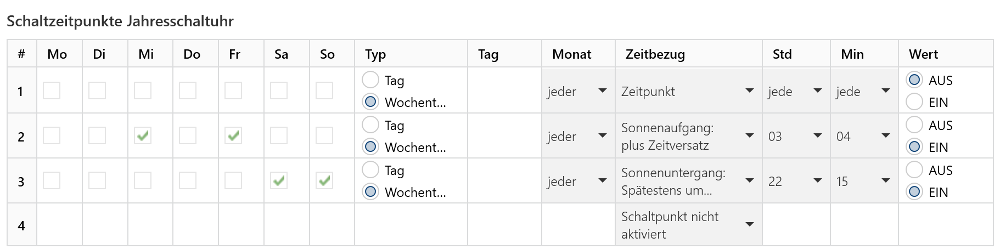</kbd>

Bei der Jahresschaltuhr sind fast alle Spalten der Tagesschaltuhr vorhanden. Im folgenden werden die zusätzlichen Spalten der Jahresschaltuhr beschrieben.

### **Spalte: Typ**

Ist nur bei der Jahresschaltuhr vorhanden.

Bestimmt, ob der Schaltpunkt an einem bestimmten Tag erfolgt, oder ob mehrere Wochentage angegeben werden können. Wird "Tag" ausgewählt, kann man in der Spalte Tag einen bestimmten Tag angeben. Wird "Wochentag" ausgewählt, kann man in den Spalten "Mo" (Montag) bis "So" (Sonntag) die Wochentage auswählen, an den geschaltet wird.

### **Spalten: Mo, Di, Mi, Do, Fr, Sa, So**

Sind nur bei der Jahresschaltuhr vorhanden.

Die Spalten sind nur eingabebereit, wenn in der Spalte Typ der Wert "Wochentag" ausgewählt wurde.

Man kann die Wochentage auswählen, an den für diesen Schaltpunkt geschaltet werden soll, natürlich unter Berücksichtigung der restlichen Angaben. So kann man Aktionen an bestimmten Wochentagen definieren.

### **Spalte: Tag**

Ist nur bei der Jahresschaltuhr vorhanden.

Die Spalte ist nur eingabebereit, wenn in der Spalte Typ der Wert "Tag" ausgewählt wurde.

In dieser Spalte wird der Tag eingestellt, an dem geschaltet werden soll.

Wird hier der Wert "jeder" ausgewählt, wird der Schaltpunkt jeden Tag ausgeführt, natürlich unter Berücksichtigung des angegebenen Monats. So kann man täglich wiederkehrende Aktionen definieren.

### **Spalte: Monat**

Ist nur bei der Jahresschaltuhr vorhanden.

In dieser Spalte wird der Monat eingestellt, an dem geschaltet werden soll.

Wird hier der Wert "jeder" ausgewählt, wird der Schaltpunkt jeden Monat ausgeführt, natürlich unter Berücksichtigung des angegebenen Tages. So kann man Monatlich wiederkehrende Aktionen definieren.

## **Ausgang**

Zwischen dem Ausgang der Logik-Operation und dem physikalischen Ausgang des Logikkanals (als Kommunikationsobjekt, um KNX-Telegramme zu verschicken) können Funktionsblöcke aktiviert werden (dargestellt im Kapitel Logikblöcke), die das Ausgangssignal beeinflussen.

In der Grundeinstellung sind alle Funktionsblöcke deaktiviert und die Signale der logischen Operation gelangen direkt zum physikalischen Ausgang.

## Definition Ausgang

Im folgenden Werden alle Funktionsblöcke, deren Einstellungen und deren Beeinflussungsmöglichkeiten beschrieben.

<kbd></kbd>

### **Beschreibung Ausgang**

Diese Einstellung hat keine funktionale Auswirkung, erlaubt es aber, dem Ausgang einen Text zu geben, um ihn einfacher zu finden.

Der eingegebene Text erscheint auf dem Ausgang-Tag des Logikkanals und als Name des Kommunikationsobjekts, das diesem Ausgang zugeordnet ist.

### **Kommunikationsobjekt für Ausgang**

Hier wird die Nummer des Kommunikationsobjektes für diesen Ausgang angezeigt. Dies dient nur zur Information und hat keine funktionale Auswirkung.

## Treppenlicht

<kbd>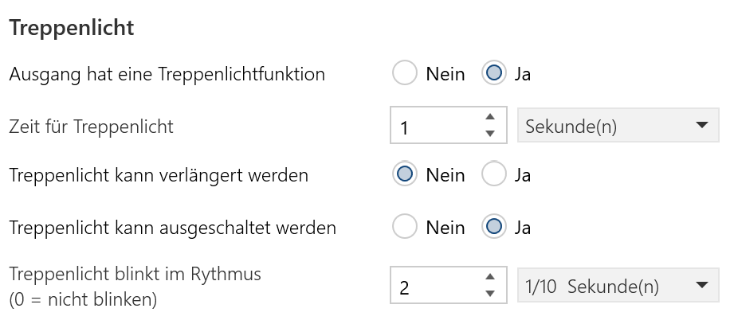</kbd>

Mit den Einstellungen kann ein Treppenlicht mit Blinkfunktion konfiguriert werden. Ein Treppenlicht erzeugt, sobald es durch ein EIN-Signal getriggert wird, ein EIN-Signal, dass nach einer gewissen Zeit zu einem AUS-Signal wird. Man kann bestimmen, ob ein weiterer Trigger mit einem EIN-Signal dazu führt, dass die Treppenlichtzeit erneut anfängt und somit der Trigger das Treppenlicht verlängert. Ferner kann man festlegen, ob ein weiterer Trigger mit einem AUS-Signal das Treppenlicht ausschaltet oder nicht.

Solange das Treppenlicht aktiv ist, kann ein Blinkmodul den Ausgang des Funktionsmoduls in einem festgelegten Intervall EIN- und AUSschalten.

### **Ausgang hat eine Treppenlichtfunktion**

Wird hier ein "Ja" ausgewählt, erscheinen die Parameter für die Treppenlichtfunktion.

#### **Zeit für Treppenlicht**

Hier gibt man die Zeit an, die das Treppenlicht eingeschaltet bleiben soll.

#### **Treppenlicht kann verlängert werden**

Wählt man hier "Ja", führt ein erneutes EIN-Signal am Eingang des Funktionsblocks zum erneuten Anlaufen der Zeitzählung bei 0. Somit wird die Treppenlichtzeit zurückgesetzt und beginnt von neuem, die Treppenlichtzeit wurde somit verlängert.

#### **Treppenlicht kann ausgeschaltet werden**

Wählt man hier ein "Ja", führt ein AUS-Signal am Eingang des Funktionsmoduls zum sofortigen Beenden des Treppenlichts und einem AUS-Signal am Ausgang des Funktionsmoduls.

Ist ein "Nein" ausgewählt, wird ein AUS-Signal am Eingang des Funktionsmoduls ignoriert und hat keine Auswirkungen, solange das Treppenlicht eingeschaltet ist.

#### **Treppenlicht blinkt im Rhythmus**

Bei einer Eingabe einer Zahl größer 0 wird, solange das Treppenlicht eingeschaltet ist, in dem angegebenen Takt der Ausgang des Funktionsmoduls abwechselnd ein EIN- und ein AUS-Signal erzeugt. Ist der Takt z.B. 2 Sekunden, wird nach 2 Sekunden von EIN auf AUS gewechselt, nach wieder 2 Sekunden dann von AUS auf EIN und so fort. Sobald das Treppenlicht beendet ist, sei es durch den Ablauf der Treppenlichtzeit oder durch ein AUS-Signal von Außen, wird das Blinken beendet und ein finales AUS-Signal gesendet.

Bei der Eingabe einer 0 wird die Blinkfunktion deaktiviert.

Der Bildschirmausschnitt oben zeigt ein Beispiel für ein 3-maliges Blinken in einer Sekunde, wobei die einzelnen Blinkzyklen nur 0,2 Sekunden dauern. Wenn man den Ausgang mit einem Buzzer verbindet, erhält man eine akustische Rückmeldung (3 mal Piep) für z.B. einen Fehlerfall.

## Ein-/Ausschaltverzögerung

<kbd>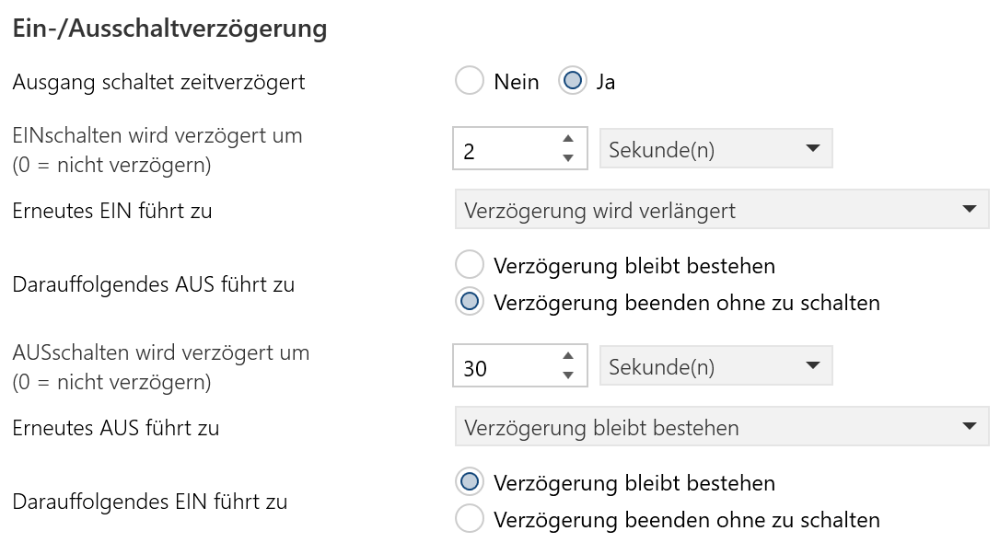</kbd>

Jedes EIN- oder AUS-Signal, dass bei diesem Funktionsblock ankommt, kann verzögert werden, mit unterschiedlichen Zeiten für die EINschalt- und AUSschaltverzögerung. Die kleinste Auflösung sind 1/10 Sekunden, um auch kurze Verzögerungen erreichen zu können.

### **Ausgang schaltet zeitverzögert**

Wird hier ein "Ja" ausgewählt, kann man im Folgenden angeben, was mit folgenden EIN- bzw. AUS-Signalen passieren soll.

#### **EINschalten wird verzögert um (0 = nicht verzögern)**

Wird hier eine Zahl größer 0 eingegeben, wird das EIN-Signal entsprechend der eingestellten Zeit verzögert am Ausgang des Funktionsmoduls ausgegeben.

Wird eine 0 eingegeben, findet keine Verzögerung statt.

#### **Erneutes EIN führt zu**

Dieses Auswahlfeld erscheint nur, wenn eine EINschaltverzögerung stattfinden soll.

Während das Funktionsmodul ein EIN-Signal verzögert, muss definiert werden, wie ein weiteres EIN-Signal während der Verzögerung behandelt werden soll.

##### **Verzögerung bleibt bestehen**

Während eine Verzögerung von einem EIN-Signal aktiv ist, werden darauffolgende EIN-Signale ignoriert. Nur das erste EIN-Signal wird verzögert und nach der festgelegten Zeit weitergesendet.

##### **Verzögerung wird verlängert**

Während eine Verzögerung von einem EIN-Signal aktiv ist, führt ein darauffolgendes EIN-Signal zum Neustart der Verzögerungszeit. Somit läuft die Verzögerung erneut an. Dies hat zur Folge, dass das letzte EIN-Signal verzögert weitergeleitet wird und faktisch alle vorhergehenden ignoriert werden.

##### **Sofort schalten ohne Verzögerung**

Kommt während eine Verzögerung eines EIN-Signals aktiv ist ein weiteres EIN-Signal, wird die Verzögerung sofort beendet und das zweite EIN-Signal sofort weitergeleitet. So kann man eine Aktion, die automatisiert verzögert laufen soll, durch ein manuelles Signal sofort beginnen lassen.

#### **Darauffolgendes AUS führt zu**

Dieses Auswahlfeld erscheint nur, wenn eine EINschaltverzögerung stattfinden soll.

Während das Funktionsmodul ein EIN-Signal verzögert, muss definiert werden, wie ein weiteres AUS-Signal während der Verzögerung behandelt werden soll.

##### **Verzögerung bleibt bestehen**

Während eine Verzögerung von einem EIN-Signal aktiv ist, führt ein darauffolgendes AUS-Signal zu keiner Reaktion, es wird ignoriert. Das EIN-Signal wird nach der eingestellten Verzögerungszeit gesendet.

##### **Verzögerung beenden ohne zu schalten**

Kommt während eine Verzögerung eines EIN-Signals aktiv ist ein AUS-Signal, wird die Verzögerung beendet und das EIN-Signal ignoriert. Auch das AUS-Signal wird nicht gesendet, da der Ausgang des Funktionsmoduls ja bereits aus war.

#### **AUSschalten wird verzögert (0 = nicht verzögern)**

Wird hier eine Zahl größer 0 eingegeben, wird das AUS-Signal entsprechend der eingestellten Zeit verzögert am Ausgang des Funktionsmoduls ausgegeben.

Wird eine 0 eingegeben, findet keine Verzögerung statt.

#### **Erneutes AUS führt zu**

Dieses Auswahlfeld erscheint nur, wenn eine AUSschaltverzögerung stattfinden soll.

Während das Funktionsmodul ein AUS-Signal verzögert, muss definiert werden, wie ein weiteres AUS-Signal während der Verzögerung behandelt werden soll.

##### **Verzögerung bleibt bestehen**

Während eine Verzögerung von einem AUS-Signal aktiv ist, werden darauffolgende AUS-Signale ignoriert. Nur das erste AUS-Signal wird verzögert und nach der festgelegten Zeit weitergesendet.

##### **Verzögerung wird verlängert**

Während eine Verzögerung von einem AUS-Signal aktiv ist, führt ein darauffolgendes AUS-Signal zum Neustart der Verzögerungszeit. Somit läuft die Verzögerung erneut an. Dies hat zur Folge, dass das letzte AUS-Signal verzögert weitergeleitet wird und faktisch alle vorhergehenden ignoriert werden.

##### **Sofort schalten ohne Verzögerung**

Kommt während eine Verzögerung eines AUS-Signals aktiv ist ein weiteres AUS-Signal, wird die Verzögerung sofort beendet und das zweite AUS-Signal sofort weitergeleitet. So kann man eine Aktion, die automatisiert verzögert ausgeschaltet werden soll, durch ein manuelles Signal sofort beenden.

#### **Darauffolgendes EIN führt zu**

Dieses Auswahlfeld erscheint nur, wenn eine AUSschaltverzögerung stattfinden soll.

Während das Funktionsmodul ein AUS-Signal verzögert, muss definiert werden, wie ein weiteres EIN-Signal während der Verzögerung behandelt werden soll.

##### **Verzögerung bleibt bestehen**

Während eine Verzögerung von einem AUS-Signal aktiv ist, führt ein darauffolgendes EIN-Signal zu keiner Reaktion, es wird ignoriert. Das AUS-Signal wird nach der eingestellten Verzögerungszeit gesendet.

##### **Verzögerung beenden ohne zu schalten**

Kommt während eine Verzögerung eines AUS-Signals aktiv ist ein EIN-Signal, wird die Verzögerung beendet und das AUS-Signal ignoriert. Auch das EIN-Signal wird nicht gesendet, da der Ausgang des Funktionsmoduls ja bereits an war.

## Wiederholungsfilter

<kbd></kbd>

Durch verschiedene Kombinationen von logischer Operation, Treppenlicht, Blinken, EIN- und AUSschaltverzögerung kann es passieren, dass mehrere EIN- oder AUS-Signale hintereinander gesendet werden und zu ungewollten Effekten auf dem KNX-Bus oder bei weiteren Logikkanälen führen.

### **Wiederholungsfilter**

Das Auswahlfeld erlaubt das Ausfiltern von unerwünschten Wiederholungen.

#### **Alle Wiederholungen durchlassen**

Es wird nichts gefiltert, sowohl mehrfach aufeinanderfolgende EIN-Signale wie auch mehrfach aufeinanderfolgende AUS-Signale werden durchgelassen und stehen auf Ausgang des Funktionsmoduls zur Verfügung.

#### **Nur EIN-Wiederholungen durchlassen**

Mehrfach aufeinanderfolgende EIN-Signale werden durchgelassen. Wenn mehrere AUS-Signale aufeinanderfolgen, wird nur das erste AUS-Signal zum Ausgang des Funktionsmoduls durchgelassen.

#### **Nur AUS-Wiederholungen durchlassen**

Mehrfach aufeinanderfolgende AUS-Signale werden durchgelassen. Wenn mehrere EIN-Signale aufeinanderfolgen, wird nur das erste EIN-Signal zum Ausgang des Funktionsmoduls durchgelassen.

#### **Keine Wiederholungen durchlassen**

Alle Wiederholungen von EIN- oder AUS-Signalen werden ignoriert, es wird immer nur das erste EIN- oder AUS-Signal durchgelassen. Somit stehen am Ausgang des Funktionsmoduls effektiv nur Signalwechsel zur Verfügung.

## Zyklisch senden

<kbd>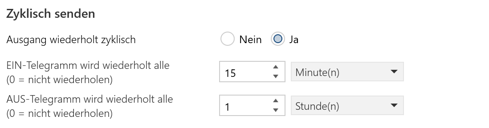</kbd>

Nachdem durch den Wiederholungsfilter unbeabsichtigte Wiederholungen ausgefiltert wurden, werden in diesem Funktionsblock beabsichtigte Wiederholungen definiert.

### **Ausgang wiederholt zyklisch**

Wird hier ein "Ja" ausgewählt, kann man im Folgenden angeben, in welchen Zeitintervallen die EIN- bzw. AUS-Signale wiederholt werden sollen.

Man kann sowohl das EIN- wie auch das AUS-Signal in unterschiedlichen Zeitintervallen wiederholen lassen.

> **Achtung:** Auch wenn es möglich ist, eine Zeitbasis von 1/10 Sekunden zu wählen, sollte man vorsichtig mit Wiederholungsintervallen unter 1 Minute umgehen, da man damit sehr leicht den KNX-Bus lahmlegen kann.

Man kann natürlich auch nur das EIN- oder das AUS-Signal wiederholen lassen.

In dem oben dargestellten Bildschirmausschnitt würde das EIN-Signal alle 15 Minuten wiederholt werden, das AUS-Signal jede Stunde.

#### **EIN-Telegramm wird wiederholt alle (0 = nicht wiederholen)**

Das Feld erscheint nur, wenn bei "Ausgang wiederholt zyklisch" ein "Ja" ausgewählt wurde.

Die hier eingegebene Zahl bestimmt das Zeitintervall, in dem dem das EIN-Signal wiederholt wird.

Die Eingabe einer 0 deaktiviert eine Wiederholung.

#### **AUS-Telegramm wird wiederholt alle (0 = nicht wiederholen)**

Das Feld erscheint nur, wenn bei "Ausgang wiederholt zyklisch" ein "Ja" ausgewählt wurde.

Die hier eingegebene Zahl bestimmt das Zeitintervall, in dem dem das AUS-Signal wiederholt wird.

Die Eingabe einer 0 deaktiviert eine Wiederholung.

## Interne Eingänge

<kbd></kbd>

An dieser Stelle endet die binäre Verarbeitung. Alle hier ankommenden EIN- oder AUS-Signale werden, sofern verbunden, an die entsprechenden internen Eingänge weitergeleitet und triggern dort die entsprechenden logischen Operationen.

Mit den beiden Auswahlfeldern kann man bestimmen, ob nur das EIN-Signal, nur das AUS-Signal oder das EIN- und das AUS-Signal an die verbundenen internen Eingänge weitergeleitet werden.

## Wert für Ausgang

<kbd>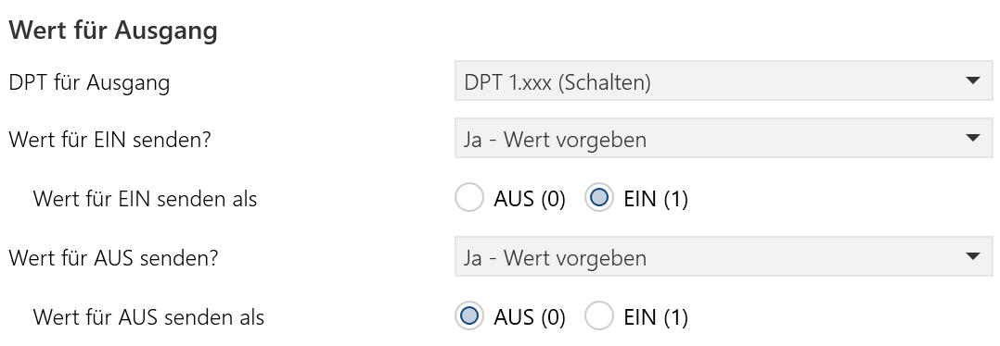</kbd>

Das letzte Funktionsmodul auf dem Ausgangsbild ist ein Konverter, der das bis hierher ermittelte EIN- oder AUS-Signal in einen bestimmten DPT konvertiert und den resultierenden Wert in ein KO schreibt, damit es auf den KNX-Bus gesendet werden kann.

### **DPT für Ausgang**

Dieses Auswahlfeld legt den DPT für den Ausgang fest. Unterstützt werden:

* DPT 1: binärer Wert
* DPT 2: Zwangsführung
* DPT 5: vorzeichenlose Zahl (0 bis 255)
* DPT 5.001: Prozentzahl (0 bis 100)
* DPT 6: vorzeichenbehaftete Zahl (-128 bis 127)
* DPT 7: vorzeichenlose Zahl (0 bis 65535)
* DPT 8: vorzeichenbehaftete Zahl (-32768 bis 32767)
* DPT 9: Gleitkommawert (-670760,96 bis 670760,96)
* DPT 16: Text (bis 14 Byte)
* DPT 17: Szenen Nummer (1-64)
* DPT 232: RGB-Wert (3*8 Bit Rot-, Grün-, Blauwert)

Je nach gewähltem DPT unterscheiden sich die folgenden Felder leicht. Es werden erst mal die parameter für alle DPT beschrieben und anschließend die DPT-spezifischen.

### **Wert für EIN senden?**

<kbd>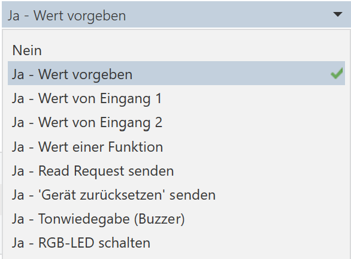</kbd>

In dieser Auswahlbox wird festgelegt, ob und was für ein Wert bei einem EIN-Signal gesendet werden soll.

#### **Nein**

Für ein EIN-Signal wird kein Wert auf den Bus gesendet. Das entspricht einem Ausgangsfilter, der alle EIN-Signale unterdrückt.

#### **Ja - Wert vorgeben**

Hier kann der Wert, der für ein EIN-Signal gesendet wird, konstant vorgegeben werden. In einem weiteren Feld kann der konstante Wert DPT gerecht eingegeben werden.

#### **Ja - Wert von Eingang 1**

Bei einem EIN-Signal wird der Wert gesendet, der am Eingang 1 anliegt. Sollte der Wert nicht den passenden DPT haben, wird er generisch gewandelt.

#### **Ja - Wert von Eingang 2**

Bei einem EIN-Signal wird der Wert gesendet, der am Eingang 2 anliegt. Sollte der Wert nicht den passenden DPT haben, wird er generisch gewandelt.

#### **Ja - Wert einer Funktion**

Bei einem EIN-Signal wird ein berechneter Wert gesendet. In einem weiteren Feld kann die Funktion ausgewählt werden, die angewendet werden soll. Sollte der Wert nicht den passenden DPT haben, wird er generisch gewandelt.

Im Kapitel Funktionen kann nachgelesen werden, wie Funktionen und Benutzerfunktionen verwendet werden können.

#### **Ja - ReadRequest senden**

Bei einem EIN-Signal wird kein Wert auf die GA am Ausgang gesendet sondern ein Lesetelegramm. Damit kann man für Geräte, die kein zyklisches Senden unterstützen, bei Bedarf eine Abfrage eines Ausgangs erreichen.

#### **Ja - 'Gerät zurücksetzen' senden**

Bei einem EIN-Signal wird kein Wert gesendet, sondern die ETS-Funktion "Gerät zurücksetzen" an eine bestimmte PA geschickt. So kann man bestimmte Geräte überwachen und bei Bedarf zurücksetzen, ohne die ETS starten zu müssen.

In einem weiteren Feld kann die PA ausgegeben werden.

#### **Ja - Tonwiedergabe (Buzzer)**

Wird nur angeboten, wenn ein Buzzer vorhanden ist.

Bei einem EIN-Signal wird kein Wert gesendet, sondern der interne Buzzer zur Tonwiedergabe angesprochen. In einem weiteren Feld wird angegeben, in welcher Lautstärke die Tonwiedergabe gestartet oder ob sie gestoppt wird.

Falls der Buzzer gerade über das Kommunikationsobjekt 9 gesperrt ist, wird kein Ton ausgegeben und ein eventueller laufender Ton abgeschaltet.

Falls dieser Kanal als Alarmkanal gekennzeichnet ist, wird ein Ton unabhängig von der Sperre ausgegeben.

<kbd>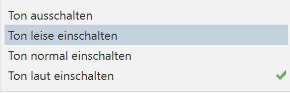</kbd>

#### **Ja - RGB-LED schalten**

Wird nur angeboten, wenn eine RGB-LED vorhanden ist.

Bei einem EIN-Signal wird kein Wert gesendet, sondern die interne RBG-LED angesprochen. So kann man eine optische Rückmeldung erreichen.

In einem weiteren Feld wird die Farbe eingestellt. Ist die Farbe Schwarz eingestellt, wir die LED ausgeschaltet.

Falls die LED gerade über das Kommunikationsobjekt 8 gesperrt ist, wird die LED nicht eingeschaltet und falls sie an ist, wird sie abgeschaltet.

Falls dieser Kanal als Alarmkanal gekennzeichnet ist, wird die LED unabhängig von der Sperre eingeschaltet.

### **Wert für EIN senden als**

<kbd>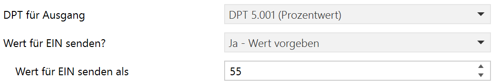</kbd>

Das Feld erscheint nur, wenn für "Wert für EIN senden" ein "Ja - Wert vorgeben" ausgewählt wurde.

Hier wird ein konstanter Wert erwartet, der zu dem Ausgewählten DPT für den Ausgang passt. Dieser eingegebene Wert wird auf den KNX-Bus bei einem EIN-Signal gesendet.

Man kann dies z.B. auch zur Invertierung nutzen, indem bei einem DPT 1 für ein EIN-Signal der Wert AUS gesendet wird und umgekehrt.

### **Physikalische Adresse**

<kbd>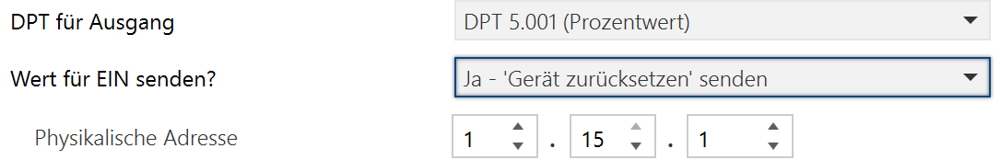</kbd>

Das Feld erscheint nur, wenn für "Wert für EIN senden" ein "Ja - 'Gerät zurücksetzen' senden" ausgewählt wurde.

Hier wird eine physikalische Adresse in der üblichen Punkt-Notation erwartet. Das KNX-Gerät mit dieser physikalischen Adresse wird zurückgesetzt.

Dies entspricht genau der Funktion "Gerät zurücksetzen" in der ETS.

### **LED-Farbe festlegen (Schwarz=aus)**

<kbd>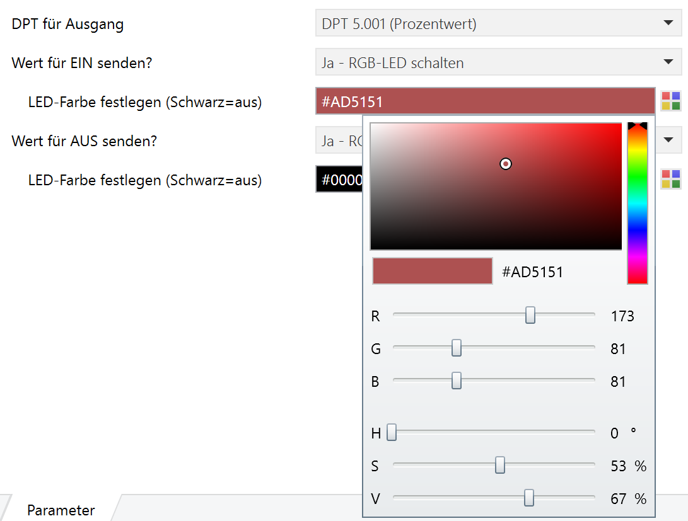</kbd>

Das Feld erscheint nur, wenn für "Wert für EIN senden" ein "Ja - RGB-LED schalten" ausgewählt wurde.

Hier wird die Farbe der LED bestimmt, in der sie leuchten soll. Wird die Farbe Schwarz gewählt (#000000), geht die LED aus. Für die Auswahl der Farbe kann auch ein Farbauswahldialog verwendet werden.

Diese Option kann nur funktionieren, wenn das Gerät, auf dem die Applikation Logik läuft, auch eine RGB-LED verbaut hat.

### **Wert für AUS senden?**

In dieser Auswahlbox wird festgelegt, ob und was für ein Wert bei einem AUS-Signal gesendet werden soll.

#### **Nein**

Für ein AUS-Signal wird kein Wert auf den Bus gesendet. Das entspricht einem Ausgangsfilter, der alle AUS-Signale unterdrückt.

#### **Ja - Wert vorgeben**

Hier kann der Wert, der für ein AUS-Signal gesendet wird, konstant vorgegeben werden. In einem weiteren Feld kann der konstante Wert DPT gerecht eingegeben werden.

#### **Ja - Wert von Eingang 1**

Bei einem AUS-Signal wird der Wert gesendet, der am Eingang 1 anliegt. Sollte der Wert nicht den passenden DPT haben, wird er generisch gewandelt.

#### **Ja - Wert von Eingang 2**

Bei einem AUS-Signal wird der Wert gesendet, der am Eingang 2 anliegt. Sollte der Wert nicht den passenden DPT haben, wird er generisch gewandelt.

#### **Ja - Wert einer Funktion**

Bei einem AUS-Signal wird ein berechneter Wert gesendet. In einem weiteren Feld kann die Funktion ausgewählt werden, die angewendet werden soll. Sollte der Wert nicht den passenden DPT haben, wird er generisch gewandelt.

Im Kapitel Funktionen kann nachgelesen werden, wie Funktionen und Benutzerfunktionen verwendet werden können.

#### **Ja - ReadRequest senden**

Bei einem AUS-Signal wird kein Wert auf die GA am Ausgang gesendet sondern ein Lesetelegramm. Damit kann man für Geräte, die kein zyklisches Senden unterstützen, bei Bedarf eine Abfrage eines Ausgangs erreichen.

#### **Ja - 'Gerät zurücksetzen' senden**

Bei einem AUS-Signal wird kein Wert gesendet, sondern die ETS-Funktion "Gerät zurücksetzen" an eine bestimmte PA geschickt. So kann man bestimmte Geräte überwachen und bei Bedarf zurücksetzen, ohne die ETS starten zu müssen.

#### **Ja - Tonwiedergabe (Buzzer)**

Wird nur angeboten, wenn ein Buzzer vorhanden ist.

Bei einem AUS-Signal wird kein Wert gesendet, sondern der interne Buzzer zur Tonwiedergabe angesprochen. In einem weiteren Feld wird angegeben, ob die Tonwiedergabe gestartet oder gestoppt wird.

Falls der Buzzer gerade über das Kommunikationsobjekt 9 gesperrt ist, wird kein Ton ausgegeben und ein eventueller laufender Ton abgeschaltet.

Falls dieser Kanal als Alarmkanal gekennzeichnet ist, wird ein Ton unabhängig von der Sperre ausgegeben.

#### **Ja - RGB-LED schalten**

Wird nur angeboten, wenn eine RGB-LED vorhanden ist.

Bei einem AUS-Signal wird kein Wert gesendet, sondern die interne RBG-LED angesprochen. So kann man eine optische Rückmeldung erreichen.

In einem weiteren Feld wird die Farbe eingestellt. Ist die Farbe Schwarz eingestellt, wir die LED ausgeschaltet.

Falls die LED gerade über das Kommunikationsobjekt 8 gesperrt ist, wird die LED nicht eingeschaltet und falls sie an ist, wird sie abgeschaltet.

Falls dieser Kanal als Alarmkanal gekennzeichnet ist, wird die LED unabhängig von der Sperre eingeschaltet.

### **Wert für AUS senden als**

Das Feld erscheint nur, wenn für "Wert für AUS senden" ein "Ja - Wert vorgeben" ausgewählt wurde.

Hier wird ein konstanter Wert erwartet, der zu dem Ausgewählten DPT für den Ausgang passt. Dieser eingegebene Wert wird auf den KNX-Bus bei einem AUS-Signal gesendet.

Man kann dies z.B. auch zur Invertierung nutzen, indem bei einem DPT 1 für ein AUS-Signal der Wert EIN gesendet wird und umgekehrt.

### **Physikalische Adresse**

Das Feld erscheint nur, wenn für "Wert für AUS senden" ein "Ja - 'Gerät zurücksetzen' senden" ausgewählt wurde.

Hier wird eine physikalische Adresse in der üblichen Punkt-Notation erwartet. Das KNX-Gerät mit dieser physikalischen Adresse wird zurückgesetzt.

Dies entspricht genau der Funktion "Gerät zurücksetzen" in der ETS.

### **LED-Farbe festlegen (Schwarz=aus)**

Das Feld erscheint nur, wenn für "Wert für AUS senden" ein "Ja - RGB-LED schalten" ausgewählt wurde.

Hier wird die Farbe der LED bestimmt, in der sie leuchten soll. Wird die Farbe Schwarz gewählt (#000000), geht die LED aus. Für die Auswahl der Farbe kann auch ein Farbauswahldialog verwendet werden.

Diese Option kann nur funktionieren, wenn das Gerät, auf dem die Applikation Logik läuft, auch eine RGB-LED verbaut hat.

### **Alarmausgabe (Buzzer oder Sperre trotz Sperre schalten)?**

Diese Einstellung erscheint nur, wenn die LED- oder Buzzer-Ausgabe aktiviert ist.

Wenn die Einstellung aktiviert ist, wird eine akustische oder optische Ausgabe trotz Sperre vorgenommen.

So können bestimmte Töne oder RGB-Anzeigen als Alarm definiert werden. Alarme können nicht durch entsprechende Sperren abgeschaltet werden.

## **Formeln**

Das Logikmodul enthält eine Implementierung zur Verwendung von einfachen (bzw. elementaren) Formeln. Formeln können immer die Werte von einem oder zwei Eingängen eines Logikkanals verrechnen. Wird ein Ausgang so definiert, dass er den Wert einer Formel senden soll, wird die dort ausgewählte Formelfunktion aufgerufen, die Berechnung anhand der beiden Eingangswerte durchgeführt und das Ergebnis an den Ausgang gesendet.

### **Berechnungszeitpunkt**

Die Formelfunktionalität innerhalb des Logikmoduls ist eingebettet in die (boolesche) Logikfunktionalität. Man konnte schon immer bei einem Ausgang verschiedene konstante Werte für EIN oder AUS senden lassen (nicht nur DPT1) bzw. auswählen, dass man statt einem konstanten Wert den Wert vom Eingang 1 oder Eingang 2 senden lassen will. Formeln stellen eine konsequente Erweiterung dieses Konzeptes vor, indem sie erlauben, den Wert von Eingang 1 und Eingang 2 erst zu verrechnen und dann das Ergebnis zu senden.

Somit wird der Berechnungszeitpunkt einer Formel durch die Logik eines Kanals bestimmt. Soll der Logikkanal ein EIN senden und am Ausgang ist eine Formel eingestellt, wird diese berechnet und deren Ergebnis gesendet.

Somit muss man neben der eigentlichen Berechnung immer auch den logischen Anteil berücksichtigen, damit die Berechnung zum gewünschten Zeitpunkt erfolgt. Es ergeben sich folgende typische Fälle:

#### **Formel soll berechnet werden, sobald sich irgendein Eingangswert ändert**

In einem solchen Fall ist der Logische Anteil unwichtig, man muss nur erreichen, dass bei jeder Wertänderung am Eingang der Ausgang senden soll.

Dazu wird eine ODER-Logik benutzt, die bei jedem Eingangssignal senden soll. Die Eingangskonverter beider Eingänge werden so eingestellt, dass sie immer zu einem EIN konvertieren. Der Ausgang sendet dann nichts bei einem AUS und die gewünschte Formel bei einem EIN.

#### **Formel soll nur berechnet werden, wenn sich ein Eingang ändert**

In einem solchen Fall darf der Logische Anteil auch nur bei einer Wertänderung an dem gewünschten Eingang getriggert werden.

Dazu wird wie zuvor eine ODER-Logik benutzt, die sendet aber nur bei dem gewünschten Eingang. Der Rest ist wie beim vorherigen Punkt.

#### **Formel soll nur zu bestimmten Zeitpunkten oder Ereignissen berechnet werden**

Hier muss die Logik des Formelkanals so aufgebaut werden, dass sie nur sendet, wenn das externe Triggersignal eingeht.

Dazu verwenden wir die selben Einstellungen wie im ersten Fall, nur nehmen wir eine UND-Logik und zusätzlich noch einen internen Eingang. Gesendet wird nur bei einem Signal auf dem internen Eingang.

Jetzt nutzen wir einen weiteren Logikkanal, um das gewünschte Triggersignal auf den Ausgang zu bringen (das kann eine Zeitschaltuhr oder ein externes Signal sein). Den Ausgang der Hilfslogik verbinden wir mit dem internen Eingang der Formellogik.

#### **Formel soll nur für bestimmte Werte von einem (oder beiden) Eingängen rechnen, sonst soll immer 0 ausgegeben werden**

Wieder muss die Logik des Formelkanals so aufgebaut werden, dass sie nur im gewünschten Fall sendet.

Wir benutzen eine UND-Logik und senden nur bei Wertänderungen. Die Eingangskonverter beider Kanäle werden so eingestellt, dass sie bei gewünschten Werten ein EIN liefern, sonst AUS. Der Ausgang senden bei EIN das Formelergebnis, bei AUS konstant 0.

### **Standardformeln**

Das Logikmodul enthält wenige bereits implementierte Standardformeln. In Zukunft können noch weitere Standardformeln hinzukommen.

<kbd>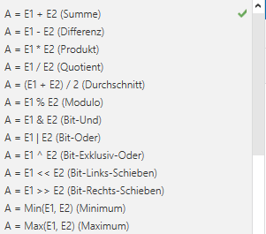</kbd>

Man kann Eingänge auch auf einen konstanten Wert setzen, um anschließend mit diesem Wert zu rechnen. Will man z.B. nur 10% eines Wertes haben, kann man am Eingang 1 den entsprechenden Wert empfangen, den Eingang 2 konstant auf 10 setzen und dann Eingang 1 / Eingang 2 rechnen.

Die Eingangswerte werden für Formeln immer in eine Fließkommazahl konvertiert, dann verrechnet und anschließend wird das (Fließkomma-)Ergebnis in den DPT des Ausgangs konvertiert.

Es empfiehlt sich, die Ergebnisse einer Formel immer durch Tests zu überprüfen, da die Genauigkeit von Fließkommazahlen oberhalb vom Zahlenwert von ca. 500 nachlässt. Rechnet man aber im Bereich von einem Byte (0 bis 255 bzw. -128 bis 127), so ist die Genauigkeit erwartungskonform.

Will man in einer Formel das Ergebnis einer anderen Formel nutzen, so geht das über die Verwendung von bestehenden KO. So kann man verhindern, dass für Formelkaskaden Zwischenergebnisse auf den Bus geschickt werden müssen.

#### **A = E1 + E2 (Summe)**

Die Werte der beiden Eingänge werden summiert und als Ergebnis am Ausgang ausgegeben.

Ist nur ein Eingang aktiv, ist der andere 0 und man bekommt den Wert des aktiven Eingangs.

#### **A = E1 - E2 (Differenz)**

Der Wert von Eingang 2 wird vom Wert von Eingang 1 subtrahiert und als Ergebnis am Ausgang ausgegeben.

Ist nur Eingang 1 aktiv, ist der andere 0 und man bekommt den Wert des aktiven Eingangs.

Ist nur Eingang 2 aktiv, ist der andere 0 und man bekommt den negativen Wert des aktiven Eingangs.

#### **A = E1 * E2 (Produkt)**

Die Werte der beiden Eingänge werden multipliziert und als Ergebnis am Ausgang ausgegeben.

Ist nur ein Eingang aktiv, ist der andere 0 und man bekommt 0 als Ergebnis.

#### **A = E1 / E2 (Quotient)**

Der Wert von Eingang 1 wird durch den Wert von Eingang 2 dividiert und als Ergebnis am Ausgang ausgegeben.

Ist nur Eingang 1 aktiv, ist der andere 0 und man bekommt keinen Wert ausgegeben.

Ist nur Eingang 2 aktiv, ist der andere 0 und man bekommt den  Wert 0 ausgegeben.

#### **A = (E1 + E2) / 2 (Durchschnitt)**

Es wird der Durchschnitt der Werte der beiden Eingänge gebildet und als Ergebnis am Ausgang ausgegeben.

Ist nur ein Eingang aktiv, ist der andere 0 und man bekommt den halben Wert des aktiven Eingangs.

#### **A = E1 % E2 (Modulo)**

Es wird eine Division mit Rest vorgenommen und der Rest als Ergebnis am Ausgang ausgegeben. Das Ergebnis liegt somit immer zwischen 0 und (E2 - 1).

Ist nur Eingang 1 aktiv, ist der andere 0 und man bekommt keinen Wert ausgegeben.

Ist nur Eingang 2 aktiv, ist der andere 0 und man bekommt den  Wert 0 ausgegeben.

#### **A = E1 & E2 (Bit-Und)**

Es wird bitweise UND-Verknüpft. Jedes Bit von E1 wird mit dem entsprechenden Bit von E2 über ein UND verknüpft. Das Ergebnis wird am Ausgang ausgegeben.

Ist nur ein Eingang aktiv, ist der andere 0 und man bekommt den Wert 0 ausgegeben.

#### **A = E1 | E2 (Bit-Oder)**

Es wird bitweise ODER-Verknüpft. Jedes Bit von E1 wird mit dem entsprechenden Bit von E2 über ein ODER verknüpft. Das Ergebnis wird am Ausgang ausgegeben.

Ist nur ein Eingang aktiv, ist der andere 0 und man bekommt den Wert des aktiven Eingangs ausgegeben.

#### **A = E1 ^ E2 (Bit-Exklusiv-Oder)**

Es wird bitweise EXOR-Verknüpft. Jedes Bit von E1 wird mit dem entsprechenden Bit von E2 über ein EXOR verknüpft. Das Ergebnis wird am Ausgang ausgegeben.

Ist nur ein Eingang aktiv, ist der andere 0 und man bekommt den Wert des aktiven Eingangs ausgegeben.

#### **A = E1 << E2 (Bit-Links-Schieben)**

Der Wert vom Eingang 1 wird bitweise nach links verschoben, um so viele Stellen wie der Wert vom Eingang 2. Das Ergebnis wird am Ausgang ausgegeben.

Ist nur Eingang 1 aktiv, ist der andere 0 und man bekommt den Wert von Eingang 1 ausgegeben.

Ist nur Eingang 2 aktiv, ist der andere 0 und man bekommt den  Wert 0 ausgegeben.

#### **A = E1 >> E2 (Bit-Rechts-Schieben)**

Der Wert vom Eingang 1 wird bitweise nach rechts verschoben, um so viele Stellen wie der Wert vom Eingang 2. Das Ergebnis wird am Ausgang ausgegeben.

Ist nur Eingang 1 aktiv, ist der andere 0 und man bekommt den Wert von Eingang 1 ausgegeben.

Ist nur Eingang 2 aktiv, ist der andere 0 und man bekommt den  Wert 0 ausgegeben.

#### **A = Min(E1, E2) (Minimum)**

Die Werte der beiden Eingänge werden verglichen und der kleinere Wert wird als Ergebnis am Ausgang ausgegeben.

Ist nur ein Eingang aktiv, ist der andere 0 und man bekommt 0, falls der aktive Eingang positiv ist. Falls der aktive Eingang negativ ist, bekommt man den Wert des aktiven Eingangs.

#### **A = Max(E1, E2) (Maximum)**

Die Werte der beiden Eingänge werden verglichen und der größere Wert wird als Ergebnis am Ausgang ausgegeben.

Ist nur ein Eingang aktiv, ist der andere 0 und man bekommt 0, falls der aktive Eingang negativ ist. Falls der aktive Eingang positiv ist, bekommt man den Wert des aktiven Eingangs.

### **Benutzerfunktionen**

Die eigentliche Stärke des Formelansatzes liegt sicherlich nicht in den implementierten Standardfunktionen, sondern in den 30 zur Verfügung stehenden Benutzerfunktionen.

Man kann direkt in der Firmware bis zu 30 eigene Funktionen definieren und die beliebigen Logikausgängen zuweisen. So kann man z.B. aus einer Entfernungsmessung, wohl wissend dass dies der Füllstand einer Zisterne ist, den Messwert direkt in Liter umrechnen, indem man im Coding der Firmware alle weiteren Parameter (Tankhöhe, Tankfläche usw.) in einer passenden Formel hinterlegt. Insofern dürften Benutzerfunktionen besonders im Zusammenhang mit dem Sensormodul genutzt werden.

Um eigene Benutzerfunktionen zu implementieren, muss man die gesamte Entwicklungsumgebung installieren und alle Programmdateien runterladen.

<kbd>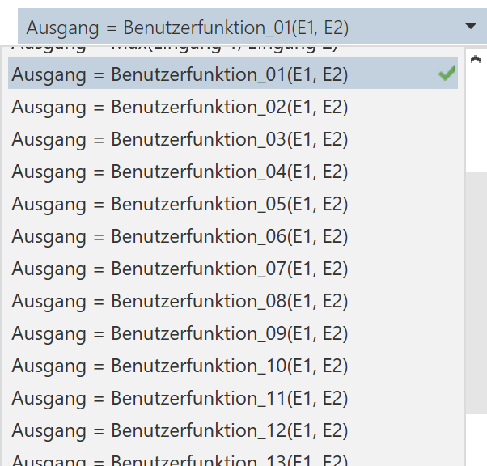</kbd>

Alle Benutzerfunktionen werden gleichartig aufgerufen, im Folgenden wird nur eine behandelt.

#### **Ausgang = Benutzerfunktion_xx(E1, E2)**

Sobald der Ausgang senden soll, ruft er die angegebene Benutzerfunktion mit den Werten der Eingänge 1 und 2 auf. Nachdem die Berechnung erfolgt ist, sendet der Ausgang den berechneten Wert.

Nichtaktive Eingänge bekommen den Wert 0 beim Aufruf der Funktion.

#### **Definition einer Benutzerfunktion in der Firmware**

Eine Benutzerfunktion kann in der Firmware entsprechend programmiert werden. Dies erfolgt im Projekt OAM-LogicModule.

In der Datei

    src/LogicFunctionUser.cpp

stehen bereits 30 Benutzerfunktionen bereit, die nur noch mit dem notwendigen Code gefüllt werden müssen.

    // user functions, may be implemented by Enduser
    // for DPT-Check you can use constants beginning with VAL_DPT_*
    float LogicFunction::userFunction01(uint8_t DptE1, float E1, uint8_t DptE2, float E2, uint8_t *DptOut)
    {
        return E1; // just an expample, result is first parameter value
    }

In der Beispielimplementierung für die Benutzerfunktion_01 wird der Wert vom Eingang 1 zurückgegeben.

Jeder Funktion stehen die Variablen E1 und E2 zur Verfügung, die die Werte der Eingänge 1 und 2 enthalten. Ferner stehen über die Variablen DptE1 und DptE2 die DPT der Eingänge E1 und E2 zur Verfügung. Die Werte können mittels Konstanten beginnend mit VAL_DPT_* abgefragt werden. Diese Konstanten sind folgendermaßen definiert:

    // enum supported dpt
    #define VAL_DPT_1 0
    #define VAL_DPT_2 1
    #define VAL_DPT_5 2
    #define VAL_DPT_5001 3
    #define VAL_DPT_6 4
    #define VAL_DPT_7 5
    #define VAL_DPT_8 6
    #define VAL_DPT_9 7
    #define VAL_DPT_16 8
    #define VAL_DPT_17 9
    #define VAL_DPT_232 10

### **Beispiele von Benutzerfunktionen**

**Wie bekommt man die frühere Funktion "Feiertag heute" (die ein Bool, also DPT1 ausgibt) wieder?**

Folgende Definition eines Logikkanals macht das gewünschte:

* Beschreibung des Kanals: Feiertag heute
* Zeit bis der Kanal nach einem Neustart aktiv wird: 5
* Logik-Operation: ODER
* Eingang 1: normal aktiv
* Logik sendet ihren Wert weiter: nur bei geändertem Ergebnis

Eingang 1:

* Beschreibung Eingang 1: Welcher Feiertag ist heute
* DPT für Eingang 1: DPT 5.xxx (1-Byte-Wert)
* Wert für Eingang 1 wird ermittelt durch: Wertintervall
* Von-Wert: 1
* Bis-Wert: 50
* Falls Vorbelegung aus dem Speicher nicht möglich: Wert von Bus lesen

Ausgang:

* Beschreibung: Feiertag heute

Auf diese Weise bekommt man die Funktionalität des früheren Logikmoduls wieder. Man muss den Eingang des Logikkanals mit der gleichen GA verbinden, die auch mit "Welcher Feiertag ist heute" verbunden ist.

Anlog für "Feiertag morgen".

## **Diagnoseobjekt**

Das Diagnoseobjekt dient primär zu Debug-Zwecken, kann aber auch vom Enduser genutzt werden, um bestimmte interne Zustände vom Logikmodul zu überprüfen. 

Es funktioniert wie ein einfaches Terminal. Man sendet an das KO 7 ein Kommando (Groß-Kleinschreibung beachten) und erhält über das gleiche KO eine Antwort. Im folgenden sind die Kommandos und die Antworten beschrieben.

### **Kommando 't' - interne Zeit**

Gibt die interne Zeit aus. Eine Zeit kann jederzeit von außen über die KO 2 (Uhrzeit) und KO 3 (Datum) gesetzt werden und läuft dann intern weiter. Die Genauigkeit der internen Uhr ist nicht besonders hoch, ein erneutes senden der Uhrzeit auf KO 2 korrigiert die interne Uhrzeit wieder. Die interne Uhrzeit kann mit diesem Kommando abgefragt werden.

Auf KO 7 (Diagnoseobjekt) muss der Buchstabe 't' (klein) gesendet werden. Die Antwort erfolgt auf KO 7 (Diagnoseobjekt) im Format 'HH:MM:SS DD.MM', also als 'Stunden:Minuten:Sekunden Tag.Monat'.

### **Kommando 'r' - Sonnenauf-/-untergang**

Gibt die intern berechneten Zeiten für Sonnenauf- und -untergang aus. Die Zeiten werden erst berechnet, nachdem mindestens einmal das Datum auf KO 3 gesetzt worden ist, dann bei jedem Datumswechsel, egal ob dieser Wechsel intern ermittelt oder durch ein neues von extern gesetztes Datum erfolgt. Die korrekte Berechnung von Zeiten für den Sonnenauf- und -untergang hängt auch von der korrekten Angabe der Geokoordinaten für den Standort ab.

Auf KO 7 (Diagnoseobjekt) muss der Buchstabe 'r' (klein) gesendet werden. Die Antwort erfolgt auf KO 7 (Diagnoseobjekt) im Format 'RHH:MM SHH:MM'. Dabei bedeutet "R" den Sonnenaufgang (Sun**R**ise), gefolgt von Stunden:Minuten, und "S" den Sonnenuntergang (Sun**S**et), gefolgt von Stunden:Minuten.

### **Kommando 'o' - Ostern**

Gibt das intern berechnete Datum für den Ostersonntag aus. Das Datum wird erst berechnet, nachdem mindestens einmal das Datum auf KO 3 gesetzt worden ist, dann bei jedem Jahreswechsel, egal ob dieser Wechsel intern ermittelt oder durch ein neues von extern gesetztes Datum erfolgt.

Auf KO 7 (Diagnoseobjekt) muss der Buchstabe 'o' (klein) gesendet werden. Die Antwort erfolgt auf KO 7 (Diagnoseobjekt) im Format 'ODD.MM'. Dabei steht "O" für **O**stern, gefolgt von Tag.Monat. Alle anderen Feiertage, die von Ostern abhängig sind, werden in Abhängigkeit von diesem Datum errechnet.

### **Kommando 'l\<nn>' - interner Zustand vom Logikkanal \<nn>**

Gibt den internen Zustand des Logikkanals \<nn> aus. Konkret geht es um die Werte, die am Eingang des Funktionsblocks "Logische Verknüpfung" liegen und dessen Ausgang. Da die Werte am Eingang durch die Konverter-Funktionsblöcke erzeugt werden, ist es im Fehlerfalle interessant, die Eingangswerte zu kennen. Ebenso ist der Ausgangswert interessant, da dieser durch die Einstellungen des Funktionsblocks "Logische Verknüpfung" bestimmt wird.

Auf KO 7 (Diagnoseobjekt) muss der Buchstabe 'l' (klein) gefolgt von der Nummer des Kanals (ohne Leerzeichen dazwischen) gesendet werden (z.B. l01). Die Antwort erfolgt auf KO 7 (Diagnoseobjekt) im Format 'Aa Bb Cc Dd Qq', wobei

* A der Eingang 1
* B der Eingang 2
* C der interne Eingang 1
* D der interne Eingang 2
* Q der Ausgang

ist. Die möglichen Werte a, b, c, d und q sind:

* 0 für den logischen Wert AUS
* 1 für den logischen Wert EIN
* X für den Wert "undefiniert" bzw. "inaktiv"

## **DPT Konverter**

Das Gerät hat ein Funktionsmodul DPT-Konverter eingebaut, dass parameterlos funktioniert (deswegen wird es auch generischer Konverter bezeichnet).

Der DPT Konverter konvertiert einen Von-DPT in einen Nach-DPT und wird implizit an Stellen aufgerufen, an den das notwendig ist, wenn also für Berechnungen oder Zuweisungen unterschiedliche DPT vorliegen.

Derzeit passiert das...

* ... bei einem Differenzkonverter, wenn die beiden Eingänge unterschiedliche DPT haben. Hier ist der Nach-DPT immer der DPT, den der Eingang besitzt, der den Differenzkonverter nutzt. Der Von-DPT ist der DPT des "anderen" Eingangs.
* ... bei einem Ausgang, wenn dieser den Wert eines Eingangs senden soll und die unterschiedliche DPT haben. Hier ist der Von-DPT immer der Eingangs-DPT und der Nach-DPT der Ausgangs-DPT.

Da die Konvertierung nicht parametrierbar ist, erfolgt sie nach einfachen (generischen) Regeln. Auch wenn prinzipiell von jedem Von-DPT zu jedem Nach-DPT konvertiert werden kann, müssen für einige Konvertierungen die Rahmenbedingungen bekannt sein, vor allem wie in Grenzfällen verfahren wird. Es ist z.B. offensichtlich, dass ein 2-Byte-Wert 365 nicht verlustfrei in einen 1-Byte-Wert (Wertebereich 0-255) konvertiert werden kann.

Konvertierungen erfolgen nach folgender Tabelle, wobei der Von-DPT in den Zeilen, der Nach-DPT in den Spalten steht:

DPT | 1 | 2 | 5 | 5.001 | 6 | 7 | 8 | 9 | 16 | 17 | 232
:---:|---:|---:|---:|---:|---:|---:|---:|---:|---:|---:|---:
1 | I | ZB | GB | GB | GB | GB | GB | GB | TB | SB | GB
2 | B | I | GZ | GZ | GZ | GZ | GZ | GZ | TZ | SZ | GZ
5 | B | Z | I | GW | G | G | G | G | T | S  | G
5.001 | B | Z | G | I | G | G | G | G | T | S | G
6 | B | Z | GV | GVW | I | GV | G | G | T | S  | G
7 | B | Z | GW | GW | GW | I | G | G | T | S  | G
8 | B | Z | GVW | GVW | GW | GV | I | G | T | S  | G
9 | B | Z | GVW | GVW | GW | GVW | GW | I | T | S  | G
17 | B | Z | G | G | G | G | G | G | T | I | G
232 | B | Z | GVW | GVW | GW | GVW | GW | GW | T | S  | I

Die Einträge an den Schnittpunkten haben folgende Bedeutung:

Eintrag | Konverter | Bedeutung
:---:|:---|:---
I | Identität | keine Konvertierung notwendig, DPT sind gleich
B | Binär | Wert wird in eine Ganzzahl gewandelt. Eine 0 wird in ein AUS-Signal konvertiert, alle anderen Werte in ein EIN-Signal.
G | Generisch | Wert wird in eine Ganzzahl gewandelt und anschließend zugewiesen.
GB | Generisch (von Binär) | AUS wird in eine 0 konvertiert, EIN in eine 1.
GV | Generisch (mit geändertem Vorzeichen) | Wie G, nur hat der Von-DPT möglicherweise ein Vorzeichen. Falls der Wert negativ ist, wird vor der Zuweisung das Vorzeichen entfernt (mit -1 multipliziert).
GW | Generisch (mit Werteinschränkung) | Wie G, nur hat der Von-DPT einen größeren Wertebereich als der Nach-DPT. Vor der Zuweisung wird noch modulo Wertebereich des Nach-DPT gerechnet.
GVW | Generisch (mit geändertem Vorzeichen und Werteinschränkung) | Wie GV gefolgt von GW.
GZ | Generisch (von Zwang) | "normal aus" (00) wird in eine 0 konvertiert, "normal ein" (01) in eine 1, "priorität aus" (10) in eine 2 und "priorität ein" (11) in eine 3.
S | Szene | Wert wird in eine Ganzzahl gewandelt. Falls negativ, wird das Vorzeichen entfernt (mit -1 multipliziert). Anschließend werden die untersten 6 Bit (Bit0 bis Bit5) genommen. Resultat ist Szene 1-64.
SB | Szene (von Binär) | AUS wird in die Szene 1 konvertiert, EIN in eine Szene 2.
SZ | Szene (von Zwang) | Wie GZ, nur ist die resultierende Szene der konvertierte Wert + 1. Es kommen somit Szenen 1-4 raus.
T | Text | Wert wird in eine Zahl gewandelt und anschließend als Text ausgegeben.
TB | Text (von Binär) | AUS wird in in den Text "0" konvertiert, EIN in den Text "1".
TZ | Text (von Zwang) | Wie GZ, nur werden die Zahlen als Text ausgegeben.
Z |Zwang | Wert wird in eine Ganzzahl gewandelt. Falls negativ, wird das Vorzeichen entfernt (mit -1 multipliziert). Anschließend werden die letzten beiden Bit (Bit0 und Bit1) genommen. Resultat sind die Werte 0 bis 3.
ZB |Zwang (von Binär) | Ein AUS wird nach "normal aus" (00) konvertiert, EIN nach "normal ein" (01). Die Werte "priorität aus" (10) und "priorität ein" sind nicht möglich.

----

## **Beispiele**

### **Zeitschaltuhr soll jeden n-ten Tag schalten**

Bei einer Zeitschaltuhr kann man aktuell jeden Tag was schalten lassen oder bestimmte Wochentage auswählen. Jeden n-ten Tag kann man derzeit nicht einstellen.

Um jeden n-ten Tag zu schalten (im Beispiel jeden 3-ten Tag), kann man folgendes machen:

- man macht eine Zeitschaltuhr mit Schaltzeiten für jeden Tag
- hinter den Ausgang der Zeitschaltuhr hängt man ein Tor, dass nur jeden 3. Tag öffnet
- Um das Tor jeden dritten Tag zu öffnen, braucht man
    - einen Zähler
    - den Zähler triggert man täglich (über eine weitere Zeitschaltuhr)
    - Wenn der Zähler den Wert n (im Beispiel 3) erreicht, muss man ihn auf 0 zurücksetzen.

Im folgenden wird ein funktionierendes Beispiel mit allen Eingaben gezeigt.

#### **Zeitschaltuhr mit den passenden Schaltzeiten**

Definition der Zeitschaltuhr mit den Schaltzeiten, die alle 3 Tage gesendet werden sollen.

<kbd>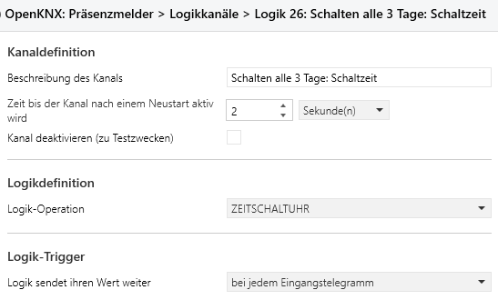</kbd>

Hier wird nur beispielhaft eine Einschaltzeit um 10 Uhr und Ausschaltzeit um 12 Uhr definiert.

<kbd>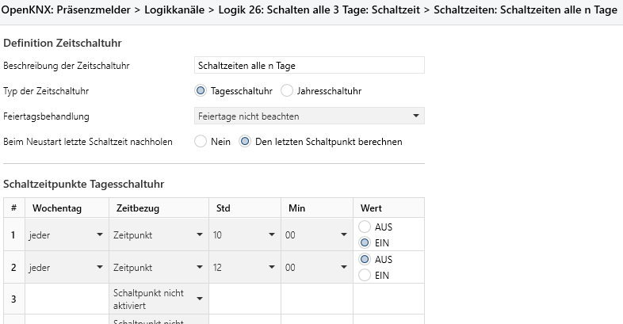</kbd>

Der Ausgang für die Schaltzeit kann so definiert sein, dass keine Daten auf den Bus gesendet werden und alle Werte intern verbunden werden.

<kbd>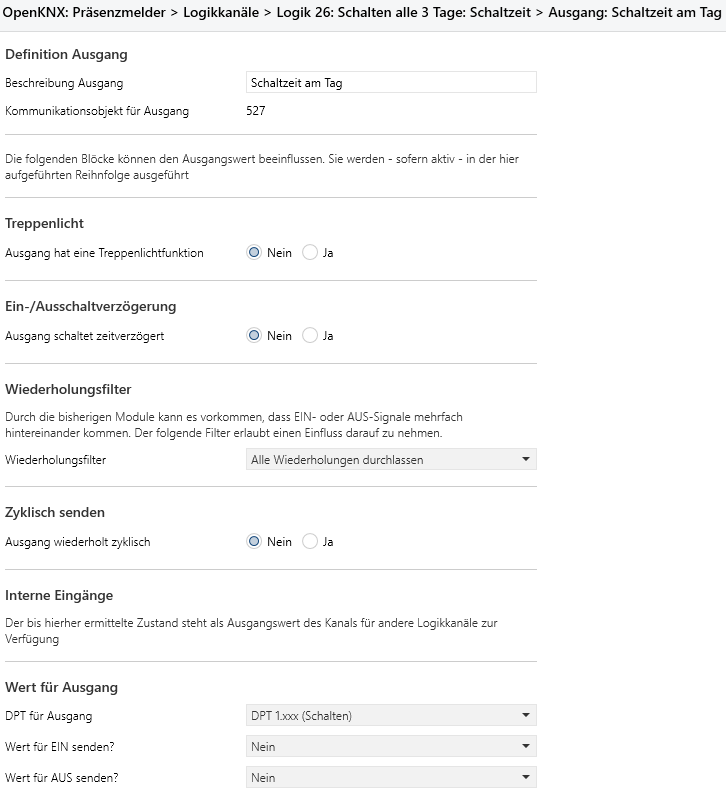</kbd>

#### **Täglicher Trigger für den Zähler**

Definition der Trigger-Zeitschaltuhr täglich um 00:01.

<kbd>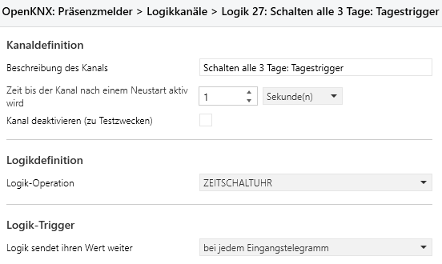</kbd>

Es wird nur eingeschaltet...

<kbd>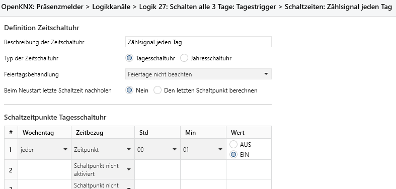</kbd>

Das Ausschaltsignal vom Trigger wird durch ein Treppenlicht von 3 Sekunden erzeugt. Auch dieser Ausgang sendet nichts auf den Bus, die Werte werden intern verknüpft.

<kbd></kbd>

#### **Zähler**

Hier werden 3 Eingänge über ein UND verknüpft. Ganz wichtig ist, dass nur der interne Kanalausgang X zur Auswertung der UND-Verknüpfung führt. 

<kbd>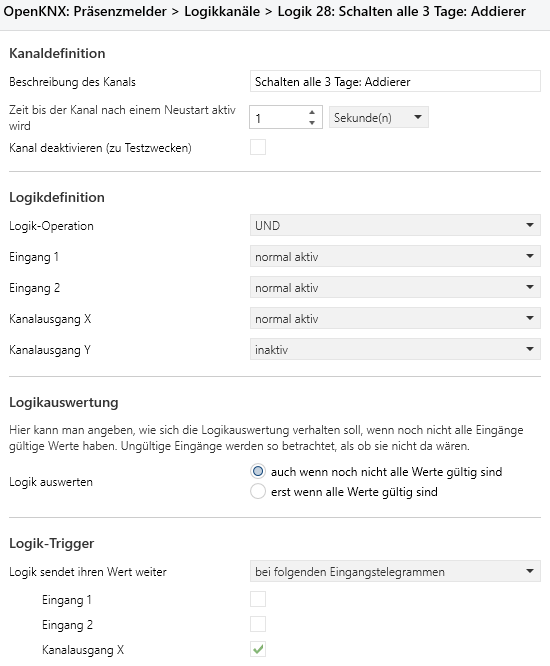</kbd>

Der erste Eingang ist das Zähler-Kommunikationsobjekt, das in unserem Beispiel bis 3 zählt, also die Werte 0, 1 und 2. Damit das UND funktioniert, muss der Wert von diesem Eingang immer EIN sein. Deswegen ist das Wertintervall von 0 bis 255, also alle möglichen Werte. Damit bei einer Neuprogrammierung bzw. Stromausfall der Zähler nicht wieder bei 0 anfängt, wird der Wert gespeichert und bei einem Neustart vorbelegt.

<kbd>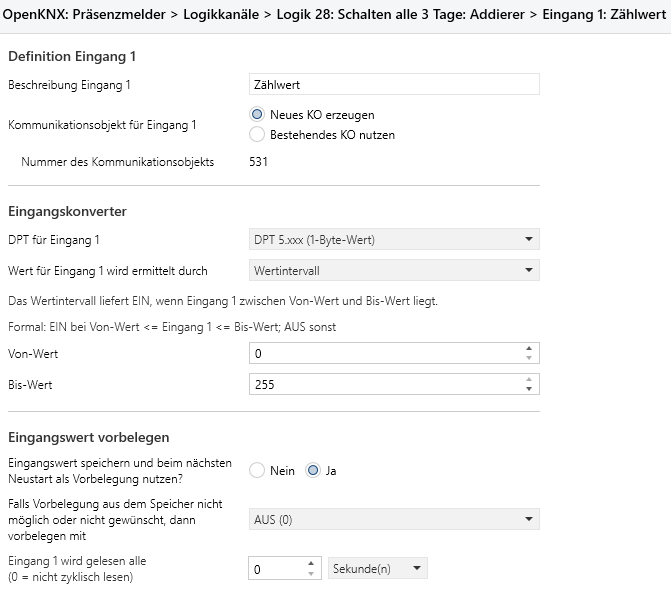</kbd>

Der zweite Eingang ist konstant 1. Das ist der Wert, um den der Zähler erhöht wird. Eine Konstante hat immer den Wert EIN, somit ist das für das UND genügend.

<kbd>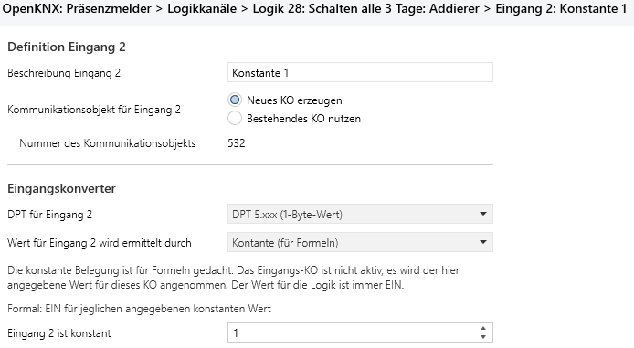</kbd>

Die interne Verknüpfung mit dem Kanalausgang vom Kanal 27 verbindet mit dem Ausgang vom Täglichen Trigger. Die gelb markierte Nummer muss den korrekten Kanal adressieren, falls das Beispiel nachgebaut wird.

<kbd></kbd>

Die Addition wird nur vorgenommen, wenn das UND wahr wird. Da Eingang 1 und Eingang 2 immer wahr sind, wird das UND immer wahr, wenn der (interne) Triggereingang wahr wird (also jeden Tag um 00:01 Uhr).

Der Ausgang sendet nur bei einer 1, dann immer einen Wert um 1 höher als der alte Wert. 

<kbd></kbd>

> Achtung: Wenn auf der Hauptseite das Häkchen nicht nur bei *Kanalausgang X* und nirgendwo anders gesetzt ist, würde die Erhöhung um 1 sofort eine erneute Addition um 1 auslösen, die wiederum eine erneute Addition um 1 auslösen würde usw. Wir hätten hier aus Endlosschleife und eine hohe Buslast. 

#### **Zähler zurücksetzen**

Immer wenn der Zähler den Wert 3 erreicht, muss er wieder auf 0 gesetzt werden. Dieser Kanal ist nichts anderes als ein IF:

> if Zähler >= 3 then Zähler = 0

Auf der ersten Seite definiert eine Logik mit einem Eingang, üblicherweise ein ODER.

<kbd>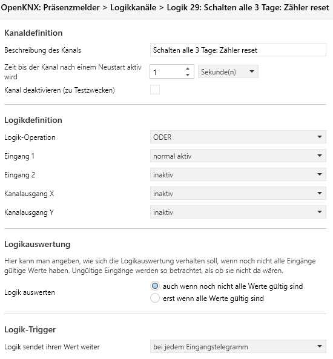</kbd>

Der Eingang spezifiziert das Wertintervall, in dem der Zähler zurückgesetzt werden soll. Falls man bis zu einem anderen Wert als 3 zählen will, muss man die gelbe 3 durch den Zielwert ersetzen.

<kbd></kbd>

Der Ausgang sendet eine 0 an den Zähler. Sobald der Zähler einen Wert 3 bis 255 erreicht.

<kbd>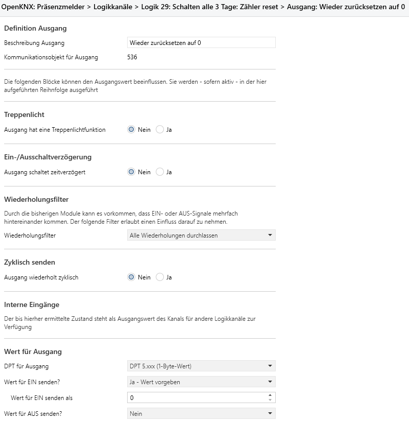</kbd>

#### **Tor zum Durchschalten der Schaltzeiten jeden dritten Tag**

Jetzt wird alles zusammen gebracht. Das Tor wird durch den Zähler geöffnet, sobald dieser den Wert 0 erreicht. Das Tor lässt dann den Wert der Zeitschaltuhr durch.

Das Tor wird so definiert, dass ein Öffnen vom Tor immer den Eingangswert sendet. Da beim öffnen die Zeitschaltuhr wahrscheinlich noch AUS ist, würde um 00:01 Uhr alle 3 Tage immer ein AUS gesendet werden. Das kann gewollt sein, falls nicht, einfach das gelb markierte Feld auf "nichts gesendet" ändern.

<kbd>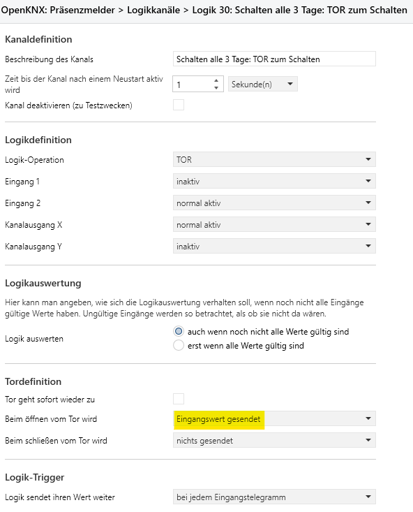</kbd>

Der Zählerwert zum öffnen vom Tor wird über den externen Eingang 2 geschickt. So kann man gleich auf den Wert 0 prüfen. 

<kbd>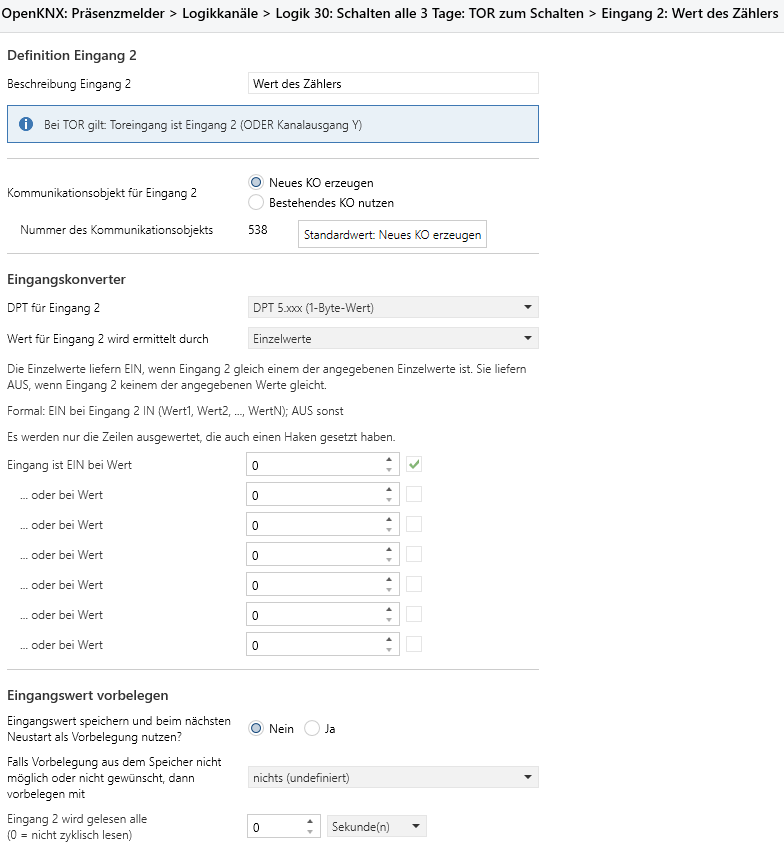</kbd>

Der aktuelle Schaltzustand der Zeitschaltuhr wird als Interner Eingang 1 mit dem Kanalausgang 26 verbunden. Auch die 26 (gelb markiert) muss bei einer Übernahme des Beispiels angepasst werden (Kanalnummer der Zeitschaltuhr mit den Schaltzeiten).

<kbd>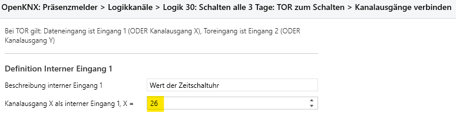</kbd>

Der Ausgang vom Tor macht nichts besonderes. Er lässt alle Signale vom Tor-Dateneingang einfach durch.

<kbd></kbd>

#### **Gruppenadressen und deren Verknüpfungen**

Es werden nur 2 GA gebraucht:

- eine transportiert den Zählerwert (DPT 5.005)
- eine für den Schaltwert alle 3 Tage

<kbd>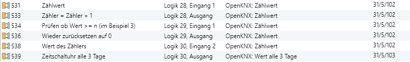</kbd>

Der Zählwert wird von Logik 28 erhöht (inkrementiert) und muss natürlich mit dem eigenen Eingang verbunden werden, damit beim nächsten erhöhen der aktuelle Wert anliegt und erhöht werden kann. Deswegen die Verknüpfung von KO 531 und KO 533.

Logik 29 soll den Zählwert zurücksetzen, wenn er 3 ist (das IF). Dazu muss der Wert an den Eingang von Logik 29 (zur Prüfung) und and den Ausgang (damit er auf 0 gesetzt werden kann). Deswegen sind KO 533 mit KO 534 und KO 536 verknüpft.

Logik 30 soll das Tor immer öffnen, wenn der Zähler = 0 ist, deswegen muss der Zählwert auch an den Eingang von Logik 30 (zur Prüfung). Deswegen ist KO 533 auch mit KO 538 verknüpft.

Der Ausgang von Logik 30 enthält die Schaltzeiten alle 3 Tage, deswegen ist hier die GA für den Schaltwert alle 3 Tage mit KO 539 verknüpft.

### **Einfacher Szenen-Controller**

Für Geräte, die keine Szenen können oder für bestimmte Zustände nur ein Setzen über ein KO und nicht über eine Szene unterstützen, möchte man sich vielleicht kleine Logiken basteln, die auf eine Szene reagiert und entsprechend ein KO schaltet.

Ebenso kann es nötig sein, über weitere Szenen das entsprechende KO wieder auszuschalten. Das Logikmodul bietet mit der Logikfunktion "Schalter", in Verbindung mit den Eingangskonvertern für "Einzelwerte", eine einfache Möglichkeit dies zu erreichen.

Folgendes Szenario wird für dieses Beispiel angenommen: 

Man hat für einen Raum Szenen definiert:

* 10 - abwesend - alles Licht und Fernseher geht aus, Rollladen ist auf Automatik, PM ist entsperrt
* 17 - fernsehen - Deckenlicht aus, Fernseher an, Rollladen geht zu, Ambientenbeleuchtung wird nicht tangiert, PM sperren
* 22 - ambiente1 - Deckenlicht aus, Ambientenbeleuchtung mit irgendwelchen angenehmen Einstellungen an
* 23 - ambiente2 - Deckenlicht aus, Ambientenbeleuchtung mit irgendwelchen anderen angenehmen Einstellungen an
* 21 - ambiente0 - Ambientenbeleuchtung aus, PM entsperren
* 18 - normal - Deckenlicht an, Fernseher aus, Rollladen auf Automatik, PM entsperren
* 55 - lesen - Deckenlicht aus, Ambientenbeleuchtung auf Leselicht, PM sperren

Rollladenaktor, Schaltaktor für den Fernseher und alle Lichtcontroller unterstützen Szenen, der PM aber nicht.

Mit nur einem Logikkanal kann man den PM in das obige Szenario einbinden. 

#### **Schalter-Logik für unterschiedliche Ein- und Ausschaltbedingungen**

Hier wird die Schalter-Logik genutzt. Diese ist Trigger-Basiert und erlaubt es, Einschalt- bzw. Ausschalt-Signale über getrennte Eingänge bereitzustellen.

<kbd>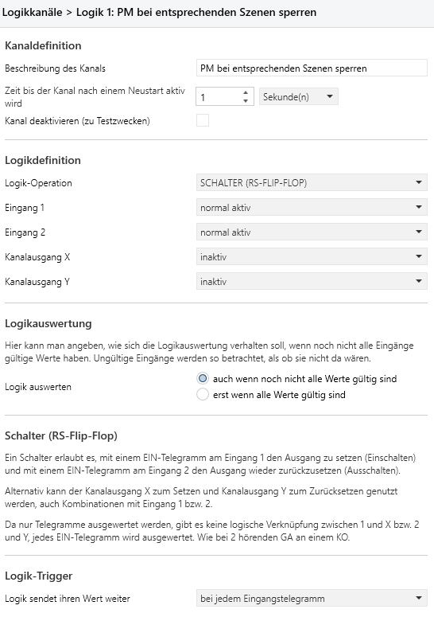</kbd>

Eingang 1 wird mit den Szenen belegt, die für ein Sperren des PM sorgen. Dafür wird der DPT17 (Szenen) gewählt mit einem Eingangskonverter, der Einzelwerte erlaubt.

<kbd>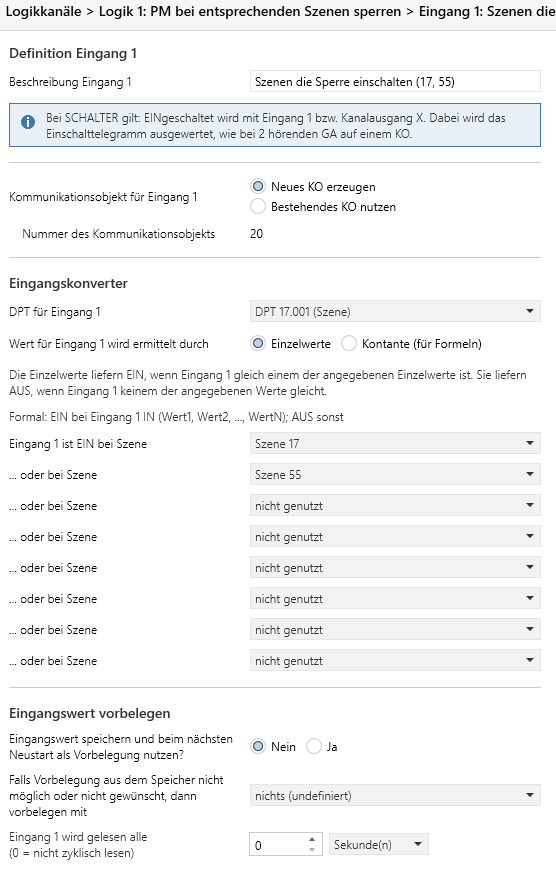<kbd>

Die Szene 17 und Szene 55 aus obigem Beispiel werden eingetragen.

Eingang 2 wird mit den Szenen belegt, die für ein entsperren des PM sorgen. Auch hier wird DPT17 (Szenen) gewählt mit einem Einzelwert-Eingangskonverter.

<kbd>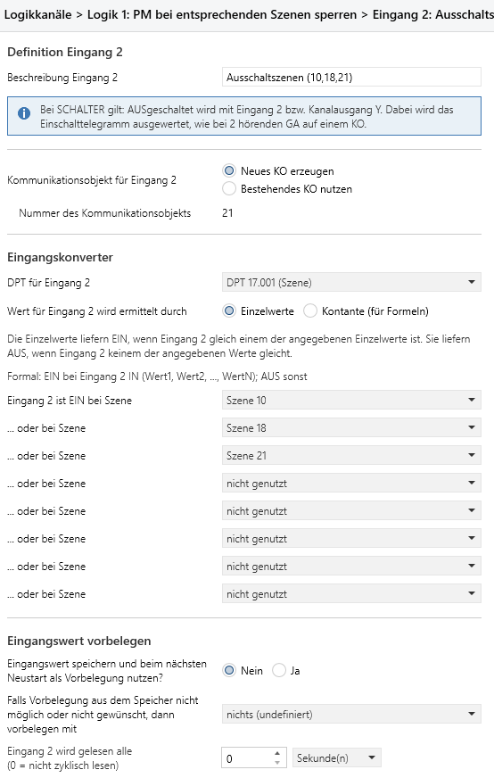</kbd>

Die Szenen 10, 18 und 21 aus obigem Beispiel werden eingetragen. Wie man sieht, können bis zu 8 Szenen pro Eingangskonverter genutzt werden.

Der Ausgang macht nichts besonderes, hier wird einfach nur ein DPT1 (Schalten) für die PM-Sperre ausgegeben. 

<kbd>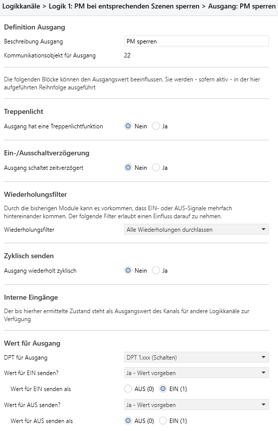</kbd>

Als Erweiterung könnte man den Ausgang auch über ein Treppenlicht, eingestellt auf z.B. 4 Stunden, die PM-Sperre ausschalten lassen, falls man vergisst, die Szene "normal" zu wählen. Dies ist in dem Beispiel nicht enthalten.

<kbd>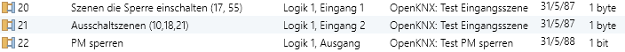</kbd>

Bei der KO-Zuordnung bekommen Eingang 1 und Eingang 2 die gleiche Szenen-GA zugewiesen, da ja die gleiche Szenen-Information für die Einschalt- wie auch für die Ausschalt-Bedingung zur Verfügung stehen muss. Der Ausgang wird mit dem Sperreingang des PM verbunden.

#### **Funktionsbeschreibung**

Wird über die GA 31/5/87 die Szene 17 (fernsehen) gesendet, sendet der Eingang 1 ein EIN-Signal an die Schalter-Logik. Diese schaltet den Ausgang auf EIN, wodurch auf der GA 31/5/88 ein EIN-Telegramm an den PM geschickt wird und diesen sperrt.

Wenn als nächstes z.B. die Szene 23 (ambiente2) gesendet wird, passiert in der Logik gar nichts, da weder Eingang 1 noch Eingang 2 auf diese Szene reagieren. Der PM bleibt somit gesperrt.

Fall die Szene 18 (normal) gesendet wird, sendet Eingang 2 ein EIN-Signal an die Schalter-Logik. Diese schaltet den Ausgang auf AUS, wodurch auf der GA 31/5/88 ein AUS-Telegramm an den PM geschickt wird und diesen entsperrt.

## **Weitere Beispiele**

Die folgenden Beispiele müssen noch ausgearbeitet werden. Die gegebenen Überschriften zeigen aber bereits jetzt eine Liste der möglichen Funktionen.

### Ist ein Fenster zu lange offen, soll der Text "Auskühlalarm" als Meldung auf dem Glastaster erscheinen

### Ist die Markise durch einen Alarm (Windalarm/Regenalarm) gesperrt, soll ein langes Piepen und ein rotes Blinken bei manueller Bedienung auf den Alarm hinweisen

### Wird die Haustür geöffnet, soll ein dreifaches Piepen darauf hinweisen, dass noch irgendeine eine Terrassentür nicht verschlossen ist

### Fernsehen oder Musikhören soll Präsenz in dem Raum simulieren

### Wenn ein Temperatursensor eine halbe Stunde lang kein Signal gesendet hat, diesen zurücksetzen

----

## **Update der Applikation**

Wie eine beliebige Applikation in der ETS aktualisiert werden kann, ist im OpenKNX-Wiki beschrieben:
<https://github.com/OpenKNX/OpenKNX/wiki/Wie-aktualisiert-man-eine-ETS-Applikation-auf-eine-aktuelle-Version>

### **Inkompatibilitäten beim Update**

Trotz intensiver Versuche, eine updatefähige Applikation zu erzeugen zeigt es sich, dass durch Erweiterungen, Benutzerwünsche und teilweises Unverständnis über die Updatefunktion der ETS es nicht möglich ist, immer ein Update ohne manuellen Eingriff anzubieten.

## **Hardware**

Dieses Kapital beschreibt die von dieser Firmware unterstützte Hardware
(noch nicht ausgearbeitet)

Buzzer

RGB-LED

----

## **Übersicht der vorhandenen Kommunikationsobjekte**

Hier werden nur Kommunikationsobjekte (KO) des Logikmoduls beschrieben, die KO anderer Module sind in der jeweiligen Applikationsbeschreibung dokumentiert.

KO | Name | DPT | Bedeutung
:---:|:---|---:|:--
1 | in Betrieb | 1.002 | Meldet zyklisch auf den Bus, dass das Gerät noch funktioniert. Das KO steht nicht zur Verfügung, wenn kein Sendezyklus eingestellt wurde.
2 | Uhrzeit | 10.001 | Eingang zum empfangen der Uhrzeit
3 | Datum | 11.001 | Eingang zum empfangen des Datums
4 | Urlaub | 1.001 | Eingang: Information über Urlaub
5 | Welcher Feiertag ist heute? | 5.010 | Ausgang: Nummer des Feiertages, falls der aktuelle Tag ein Feiertag ist, sonst 0
6 | Welcher Feiertag ist morgen? | 5.010 | Ausgang: Nummer des Feiertages, falls der morgige Tag ein Feiertag ist, sonst 0
7 | Diagnoseobjekt | 16.001 | Ein-/Ausgang für Diagnoseinformationen
8 | LED sperren | 1.001 | Eingang: LED global sperren (kein Licht)
9 | Buzzer sperren | 1.001 | Eingang: Buzzer global sperren (kein Ton)
n | Eingang 1 | *) | Eingang 1 für einen Logikkanal
n+1 | Eingang 2 | *) | Eingang 2 für einen Logikkanal
n+2 | Ausgang | **) | Ausgang eines Logikkanals

*) Eingangs-DPT ist 1, 2, 5, 5.001, 6, 7, 8, 9, 17, 232

**) Ausgangs-DPT ist Eingangs-DPT ergänzt um DPT 16.

Jeder Logikkanal hat genau 3 aufeinanderfolgende Kommunikationsobjekte. Wenn n der Eingang 1 für Kanal x ist, so ist n+3 der Eingang 1 für Kanal x+1. Bei 80 Kanälen ist das letzte KO der Ausgang für Kanal 80 und hat die Nummer n+239.

n für Kanal 1 ist von dem Gerät abhängig, auf dem die Applikation Logik läuft:

* Für das Logikmodul ist n=20, somit ist das letzte belegte KO 259.
* Für das Sensormodul ist n=125, somit ist das letzte belegte KO 364.
* Für das Wiregateway ist n=150, somit ist das letzte belegte KO 389.
* Für das Enocean-Gateway ist n=320, somit ist das letzte belegte KO 469 (50 Logikkanäle).
